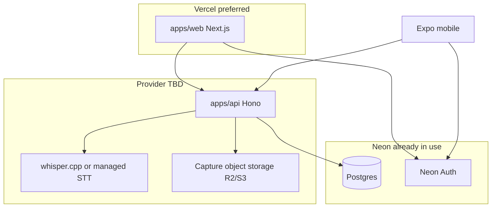
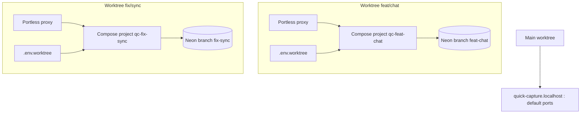

# Quick Capture — Product Plan

Quick Capture turns messy inputs (handwritten notes, voice, manual entry) into actionable todos. This document is the living roadmap. Detailed specs live in [`docs/`](./docs/).

## Current state (v0.5)

| Feature | Status | Spec |
| --- | --- | --- |
| Turborepo monorepo | ✅ Shipped | [docs/monorepo.md](./docs/monorepo.md) |
| Todo list (complete, delete, persist) | ✅ Shipped | [docs/features/todo-list.md](./docs/features/todo-list.md) |
| Manual todo entry | ✅ Shipped | [docs/features/manual-entry.md](./docs/features/manual-entry.md) |
| Camera capture → AI → review → save | ✅ Shipped | [docs/features/camera-capture.md](./docs/features/camera-capture.md) |
| Voice capture → AI → review → save | ✅ Shipped | [docs/features/voice-capture.md](./docs/features/voice-capture.md) |
| Server-side AI (OpenAI + MiniMax) | ✅ Shipped | [docs/features/ai-backend.md](./docs/features/ai-backend.md) |
| Multiple todo lists | ✅ Shipped | [docs/features/todo-list.md](./docs/features/todo-list.md) |
| Scheduled reminders (local) | ✅ Shipped | [docs/features/scheduled-reminders.md](./docs/features/scheduled-reminders.md) |
| API + Neon Postgres sync | ✅ Shipped | [docs/features/auth.md](./docs/features/auth.md) |
| Web companion (`apps/web`) | ✅ Shipped | [docs/features/web-app.md](./docs/features/web-app.md) |
| Neon Auth (web + mobile) | ✅ Shipped | [docs/features/auth.md](./docs/features/auth.md) |
| API-backed push reminders | ✅ Shipped | [docs/features/push-notifications.md](./docs/features/push-notifications.md) |
| Mobile cloud sync | ✅ Shipped | [docs/features/auth.md](./docs/features/auth.md) |
| Sync conflict resolution | ✅ Shipped | [docs/features/sync-conflicts.md](./docs/features/sync-conflicts.md) |
| Due dates (`dueAt`) | ✅ Shipped | [docs/features/due-dates.md](./docs/features/due-dates.md) |
| Todo priority | ✅ Shipped | [docs/features/todo-priority.md](./docs/features/todo-priority.md) |
| Todo tags | ✅ Shipped | [docs/features/todo-tags.md](./docs/features/todo-tags.md) |
| Subtasks | ✅ Shipped | [docs/features/subtasks.md](./docs/features/subtasks.md) |
| Export / share | ✅ Shipped | [docs/features/export-share.md](./docs/features/export-share.md) |
| Instant capture shortcuts | ✅ Shipped | [docs/features/instant-capture-shortcuts.md](./docs/features/instant-capture-shortcuts.md) |
| CMF Watch phone shortcuts | ✅ Shipped | [docs/features/cmf-watch-android-shortcuts.md](./docs/features/cmf-watch-android-shortcuts.md) |
| Apple Watch companion (scaffold) | ✅ Shipped | [docs/features/apple-watch.md](./docs/features/apple-watch.md) |
| Wear OS companion (scaffold) | ✅ Shipped | [docs/features/wear-os.md](./docs/features/wear-os.md) |
| MiniMax agent chat (mobile + web) | 🚧 In progress | [docs/features/chat.md](./docs/features/chat.md) |
| Docker Compose local dev stack | ✅ Shipped | [docs/docker-dev.md](./docs/docker-dev.md) |
| Parallel worktree dev (multi-instance Compose) | ✅ Shipped | [docs/features/worktree-dev.md](./docs/features/worktree-dev.md) |
| TLS (Let's Encrypt) + cloud deploy | 🚧 In progress | [docs/features/deployment.md](./docs/features/deployment.md) |
| Web sidebar navigation | ✅ Shipped | [docs/features/web-sidebar-nav.md](./docs/features/web-sidebar-nav.md) |
| Unit test suite | ✅ Shipped | [docs/features/unit-testing.md](./docs/features/unit-testing.md) |

## Vision

One tap from any screen to capture a thought. The app handles transcription, extraction, and review — the user only confirms what to keep.

```
Input (voice / photo / text)
        ↓
   AI extraction
        ↓
   Review & edit
        ↓
   Todo list (local SQLite offline / synced via API when signed in)
```

## Roadmap

### Phase 0 — Monorepo foundation

- [x] Turborepo + npm workspaces
- [x] Move Expo to `apps/mobile`
- [x] Create `packages/shared` and `packages/typescript-config`
- [x] Scaffold `apps/api` (Hono)
- [x] Document dev workflow in [docs/monorepo.md](./docs/monorepo.md)
- [x] Root `dev:web-api` script — run API (`:3000`) + web (`:3001`) together without mobile (`npm run dev:web-api`)

### Phase 1 — Core capture

- [x] Local todo storage
- [x] Manual todos
- [x] Camera → vision AI → review modal
- [x] Voice → transcription AI → review modal

### Phase 2 — Capture UX polish

- [x] Center tab bar microphone button (primary quick-capture affordance)
- [x] Unified review modal for all capture sources (`review-todos-form.tsx`)
- [x] Capture history / source preview on todo items (voice + camera labels)
- [x] Haptic + visual recording feedback (start/stop pulse, timer)

### Phase 2.5 — Scheduled reminders

- [x] Per-todo reminder date/time (local push notifications)
- [x] Bell affordance + set-reminder modal with presets
- [x] Cancel reminder on complete/delete; reconcile on app launch
- [x] Sync-ready schema (`reminderAt` synced; `notificationId` device-local)
- [x] Spec: [docs/features/scheduled-reminders.md](./docs/features/scheduled-reminders.md)

### Phase 3 — Cloud backend, sync, and push

- [x] **[Neon Auth](https://neon.com/docs/auth/overview)** — managed auth on Neon Postgres ([spec](./docs/features/auth.md))
  - [x] Email/password sign-in (web + mobile)
  - [ ] Google + GitHub OAuth (configure in Neon Console)
  - [x] Mobile + web clients: Neon Auth SDK; API: JWT verification via JWKS in Hono
  - [x] Branch-aware auth for preview/staging environments ([auth.md](./docs/features/auth.md#preview--staging-branches))
- [x] Neon Postgres + Drizzle migrations (`todo_lists`, `todos`, `captures`, `user_devices`)
- [x] Lists + todos REST API (`apps/api`)
- [x] Capture upload API (local disk; R2 planned for production)
- [x] **Web companion** (`apps/web`) — Neon Auth, todos, capture, voice, reminders, dark mode
- [x] **Mobile sync** — sign-in, push local todos before pull, CRUD sync to API
- [x] Todo sync including `reminderAt` (Postgres)
- [x] **API-backed push notifications** — multi-device + web ([spec](./docs/features/push-notifications.md))
  - [x] Device registration (`POST /api/devices/register`) — Expo tokens + Web Push
  - [x] Reminder worker — server fires at `reminderAt`, sends to all user devices
  - [x] Mobile: register Expo push token after auth; server replaces local schedule when synced
  - [x] Web: service worker + Web Push via VAPID
  - [x] Device management UI on web (`/devices`)
- [x] Object storage (R2 / S3-compatible) for capture media in production
- [x] Notification tap deep links (mobile + web)
- [x] Sync conflict resolution (same todo edited offline on two devices) — [spec](./docs/features/sync-conflicts.md)
- [x] Due dates (`dueAt`) — [spec](./docs/features/due-dates.md)
- [x] Priority (`low` / `medium` / `high`) — [spec](./docs/features/todo-priority.md)
- [x] Tags (`string[]`) — [spec](./docs/features/todo-tags.md)
- [x] Subtasks — [spec](./docs/features/subtasks.md)

### Phase 4 — Beyond todos

- [x] Search and filter (title search + open/done) — [spec](./docs/features/search-filter.md)
- [x] Export / share — [spec](./docs/features/export-share.md)
- [x] Widget or shortcut for instant capture — [spec](./docs/features/instant-capture-shortcuts.md)

### Phase 5 — Wearable capture

- [x] Apple Watch companion (`native/watch/`) — [spec](./docs/features/apple-watch.md) (v1 scaffold)
- [x] Wear OS module (`native/wear/`) — [spec](./docs/features/wear-os.md) (v1 scaffold)
- [x] CMF Android phone shortcuts — [spec](./docs/features/cmf-watch-android-shortcuts.md)

### Phase 6 — MiniMax agent chat

Conversational assistant tab on mobile and web. Users chat with the **MiniMax agent** (MiniMax-M2.5 via existing server-side provider) to plan work, ask about todos, and get help with capture — with **persisted thread history** synced across signed-in devices.

**Spec:** [docs/features/chat.md](./docs/features/chat.md)

#### 6.1 — Data model and API

- [x] Drizzle schema: `chat_threads` (id, userId, title, createdAt, updatedAt) and `chat_messages` (id, threadId, role, content, createdAt, metadata JSON for tool/stream state)
- [x] Shared Zod + TypeScript types in `packages/shared`
- [x] REST: list/create/update/delete threads; list messages (paginated, newest-first or cursor)
- [x] `POST /api/chat` — authenticated streaming chat (SSE) proxied to MiniMax; system prompt scoped to Quick Capture (todos, lists, capture workflows)
- [x] Persist user + assistant messages after stream completes; support resuming a thread by `threadId`
- [x] Rate limiting / max context window trimming for long threads

#### 6.2 — Web chat (`apps/web`)

Use the [June 2026 shadcn chat components](https://ui.shadcn.com/docs/changelog/2026-06-chat-components):

```bash
pnpm dlx shadcn@latest add message-scroller message bubble attachment marker
```

- [x] Route `/chat` (+ `/chat/[threadId]`) in app shell nav
- [x] Thread sidebar: new chat, search, rename, delete; auto-title from first user message
- [x] **`MessageScroller`** — anchored turns, auto-follow during MiniMax streaming, restore on thread switch
- [x] **`Message`** + **`Bubble`** — user/assistant rows, markdown body, streaming shimmer via `shimmer` utility
- [x] **`Marker`** — “Thinking…”, errors, date separators between sessions
- [x] **`Attachment`** (optional v1.1) — image upload in chat; reuse capture media pipeline
- [x] Client: SSE stream client against `/api/chat` with Neon Auth JWT
- [x] Empty state, loading skeletons, retry on failed streams

#### 6.3 — Mobile chat tab (`apps/mobile`)

- [x] New **Chat** tab in `(tabs)/_layout.tsx` (alongside Todos and Capture)
- [x] Routes: thread list → active thread; match web capabilities (new, open, delete)
- [x] Streaming UI: inverted `FlatList` or scroll view with stick-to-bottom during assistant reply (parity with `MessageScroller` behavior)
- [x] `Message` rows: avatar, bubble alignment, markdown text, typing/streaming indicator
- [x] API client in `services/chat-api-client.ts`; require sign-in (same as sync) — show sign-in prompt when logged out
- [ ] Optional: `expo-sqlite` cache of recent threads for fast open; reconcile with API on launch

#### 6.4 — Agent behavior and product polish

- [x] System prompt: Quick Capture context (lists, todos, capture sources); no direct DB writes from model — suggest actions, user confirms
- [x] Future hook: “Add as todos” from assistant suggestions → existing review-before-save flow
- [x] Cross-device: thread list and messages sync via API (source of truth in Neon Postgres)
- [x] Accessibility: labels, focus order, reduced motion for streaming markers

#### Dependencies

- Neon Auth JWT (existing)
- MiniMax provider in `apps/api/src/ai/` ([ai-backend.md](./docs/features/ai-backend.md))
- Web shadcn/ui stack ([web-app.md](./docs/features/web-app.md))

### Phase 7 — TLS, Docker Compose dev, and cloud deployment

Replace ad-hoc self-signed certs with **automated Let's Encrypt** in the local Docker stack, and define a **Vercel-first** production target while keeping API / whisper / storage choices flexible until a full cloud provider is picked.

**Spec:** [docs/features/deployment.md](./docs/features/deployment.md)

#### Why Let's Encrypt needs a real domain (even for “local” dev)

Let's Encrypt **cannot** issue certificates for `localhost`. Neon Auth also expects a stable HTTPS origin (production uses your app domain; local dev today uses self-signed `https://localhost:3001`).

For trusted certs in Docker Compose dev, use a **dev hostname** you control (e.g. `dev.quickcapture.example.com`) that resolves to your machine:

| Approach | How it works | Good for |
| --- | --- | --- |
| **DNS A/AAAA record** | Point dev subdomain to your LAN IP or public IP | Home lab, fixed IP |
| **Cloudflare Tunnel** | Tunnel exposes local compose to the internet; DNS at Cloudflare | No port forwarding, dynamic IP |
| **Tailscale Funnel / similar** | HTTPS on a MagicDNS or funnel URL | Team-only dev |

Self-signed / mkcert remain the **offline fallback** when no public domain is available ([docker-dev.md](./docs/docker-dev.md)).

#### 7.1 — Let's Encrypt in Docker Compose (local dev)

Add a reverse-proxy service to [docker-compose.yml](./docker-compose.yml) that terminates TLS and routes to existing services:

```
Browser → Caddy (or Traefik) :443  [Let's Encrypt]
              ├─→ web:3001   (Next.js dev)
              ├─→ api:3000   (Hono)
              └─→ whisper:8080 (optional; usually internal only)
```

- [x] Choose proxy: **Caddy** (built-in ACME, simplest) or Traefik + optional certbot sidecar
- [x] Add `caddy` (or `traefik`) service + shared `certs` / `acme` volume
- [x] Env: `DEV_DOMAIN`, `ACME_EMAIL` (Let's Encrypt account contact)
- [x] HTTP-01 challenge on `:80` (required for standard ACME; Caddy handles automatically)
- [x] Route `https://${DEV_DOMAIN}` → web; `https://api.${DEV_DOMAIN}` or path-based `/api` → api (pick one pattern and document it)
- [x] Mount or sync issued certs into `apps/web/certificates/` **or** drop Next.js `--experimental-https` and let the proxy handle TLS (preferred — web runs HTTP inside the compose network)
- [x] Update `.env.example`: `DEV_DOMAIN`, `ACME_EMAIL`, `CORS_ORIGINS`, `NEXT_PUBLIC_API_URL`, Neon Auth redirect URLs for the dev domain
- [ ] Update Neon Auth allowed origins / OAuth redirect URIs for the dev domain (Neon Console — per `DEV_DOMAIN`)
- [x] Compose profiles: `docker compose --profile tls up` vs default profile keeping self-signed localhost for quick offline work
- [x] Document renewal (Caddy auto-renews; cert volume persists across restarts)

**Acceptance:** `npm run docker:dev` (or `docker:dev:tls`) serves web + API on trusted HTTPS for `DEV_DOMAIN` without browser cert warnings; Neon Auth sign-in works on that origin.

#### 7.2 — Docker Compose stack maturity

Building on the shipped stack ([docker-dev.md](./docs/docker-dev.md)):

- [x] `whisper`, `migrate`, `api`, `web` services with hot reload
- [x] `TRANSCRIPTION_PROVIDER=whisper-cpp` wired in compose
- [x] TLS reverse proxy + Let's Encrypt (7.1 core — Caddy profile; Neon Console origins per domain)
- [x] Optional: `docker-compose.prod.yml` override (no bind mounts, `npm start` / built images) for staging on a VPS
- [x] Healthchecks and `depends_on` for api ← whisper already in place; extend for caddy ← web/api
- [x] **Phase 9:** `docker-compose.worktree.yml` + per-worktree port/env isolation ([worktree-dev.md](./docs/features/worktree-dev.md))

#### 7.3 — Cloud deployment (Vercel-first, provider TBD)

Target: use **Vercel wherever it fits natively**; run long-lived / heavy workloads elsewhere. Final provider for API and whisper is **not decided** — this section records the default bias and open choices.



| Component | Vercel fit | Default recommendation | Notes |
| --- | --- | --- | --- |
| **Web** (`apps/web`) | ✅ Excellent | **Deploy on Vercel** | HTTPS automatic; preview URLs per branch; env via Vercel dashboard / `vercel env pull` |
| **Neon Postgres + Auth** | ✅ Marketplace | **Keep on Neon** | Already integrated; branch-per-preview pairs with Vercel preview deployments |
| **API** (`apps/api`) | ⚠️ Partial | **Evaluate** Vercel Functions (Hono adapter) vs Railway / Fly.io / VPS | SSE chat streams, reminder worker cron, multipart uploads, whisper proxy — validate limits on chosen platform |
| **whisper.cpp** | ❌ Not on Vercel | **Separate container** (Railway, Fly, VPS, or local-only dev) | CPU/GPU bound; keep internal URL; prod may switch to managed STT later |
| **Capture storage** | Blob optional | **R2/S3** or Vercel Blob | R2 already supported in API; Vercel Blob if staying all-in on Vercel storage |
| **Mobile** | N/A (EAS) | Expo EAS | `EXPO_PUBLIC_*` points at deployed API + Neon Auth URLs |

**Vercel setup checklist (when ready):**

- [x] `apps/web/vercel.json` — monorepo install/build (Root Directory: `apps/web`)
- [x] CI: typecheck + web build on push/PR (`.github/workflows/ci.yml`)
- [ ] Link `apps/web` project: `vercel link` (monorepo root or app directory per [docs/monorepo.md](./docs/monorepo.md))
- [ ] `vercel env pull` — sync Neon, auth, and `NEXT_PUBLIC_API_URL` for preview/production
- [ ] Preview branches: Neon database branch + matching `NEON_AUTH_*` / `DATABASE_URL` ([auth.md](./docs/features/auth.md#preview--staging-branches))
- [ ] Production domain on Vercel; update Neon Auth redirect URLs and `CORS_ORIGINS` on API
- [ ] CI: deploy web on push (needs `VERCEL_ORG_ID`, `VERCEL_PROJECT_ID`, `VERCEL_TOKEN` in GitHub)

**Open decisions (document in deployment spec before shipping prod):**

1. **API host** — Vercel Functions vs Railway vs Fly vs single VPS running the existing Docker stack
2. **Whisper in prod** — self-hosted whisper.cpp vs OpenAI Whisper API vs other managed STT
3. **Single domain vs split** — e.g. `app.example.com` (Vercel) + `api.example.com` (API host) vs path routing on one domain
4. **Reminder worker** — Vercel Cron invoking API route vs always-on process on API host

**Non-Vercel fallback:** The same [docker-compose.yml](./docker-compose.yml) (+ prod override) can run on any VPS if you prefer one box for API + whisper + Caddy; web could still be on Vercel pointing at that API URL.

### Phase 8 — Web sidebar navigation

Replace the horizontal top nav in [`apps/web/src/components/app-shell.tsx`](apps/web/src/components/app-shell.tsx) with a **persistent sidebar** for primary app navigation. Mobile (`apps/mobile`) keeps the bottom **tab bar** — this phase is web-only.

**Spec (to create):** extend [docs/features/web-app.md](./docs/features/web-app.md) or add [docs/features/web-sidebar-nav.md](./docs/features/web-sidebar-nav.md)

#### Current layout (to replace)

Today `AppShell` stacks:

1. **Header** — active list dropdown, page actions, theme toggle, sign out
2. **Horizontal `<nav>`** — Todos, Capture, Voice, Chat, Devices (link buttons)
3. **Main content** — route pages
4. **Mic FAB** — fixed bottom-center quick capture

Chat already adds a **second sidebar** (`ChatThreadSidebar`) inside the main area for thread history — the app shell sidebar becomes the **primary** nav; chat threads stay a **secondary** panel within `/chat`.

```
Today                          Target
┌─────────────────────┐        ┌──────┬──────────────────────┐
│ Header + list       │        │ App  │ Page header + actions│
├─────────────────────┤   →    │ side │──────────────────────│
│ Todos Capture …     │        │ bar  │ Main content         │
├─────────────────────┤        │      │ (chat: + thread panel) │
│ Content             │        └──────┴──────────────────────┘
│        [Mic]        │
└─────────────────────┘
```

#### 8.1 — Sidebar shell (shadcn/ui)

Install and wire the [shadcn Sidebar](https://ui.shadcn.com/docs/components/sidebar) pattern:

```bash
npx shadcn@latest add sidebar
```

- [x] Add `SidebarProvider` in `(app)` layout (or refactor `AppShell` to wrap children)
- [x] New `app-sidebar.tsx` — logo/title, primary nav links, footer actions
- [x] Nav items with icons + labels: **Todos** (`/`), **Capture** (`/capture`), **Voice** (`/voice`), **Chat** (`/chat`), **Devices** (`/devices`)
- [x] Active state via `usePathname()` (`/chat` matches `/chat/*`)
- [x] Remove horizontal `<nav>` strip from `AppShell`
- [x] `SidebarInset` (or equivalent) for main content column

#### 8.2 — Header and list picker

- [x] Slim **top bar** inside main inset only (not full width over sidebar): optional page title, `headerRight` slot (e.g. Add todo), theme toggle, sign out
- [x] Move **list picker** (Inbox / lists dropdown) to one of:
  - Sidebar section below nav (recommended — always visible on Todos)
  - Todos page header only (hide on Capture / Voice / Chat)
- [x] Keep `useLists()` / `onManageLists` behavior unchanged

#### 8.3 — Responsive behavior

- [x] **Desktop (`md+`):** fixed left sidebar, collapsible to icon rail (`SidebarTrigger` + `collapsible="icon"`)
- [x] **Mobile:** sidebar hidden by default; **Sheet** or shadcn mobile sidebar trigger in top bar (hamburger)
- [x] Persist collapsed preference in `localStorage` or cookie
- [x] Adjust `min-h` / padding: remove `pb-20` meant for bottom nav; chat layout `min-h-[calc(100dvh-8rem)]` updated for new chrome heights

#### 8.4 — Quick capture (mic)

- [x] Relocate bottom-center **Mic FAB** — options (pick one in spec):
  - Sidebar footer primary action (always visible)
  - Floating FAB in main inset only (hide on `/voice` and `/chat`)
- [x] Preserve one-tap path to `/voice` from any signed-in route

#### 8.5 — Chat layout integration

- [x] App sidebar remains visible on `/chat` (or collapses to icon rail automatically)
- [x] `ChatThreadSidebar` stays as **in-content** second column — avoid triple-sidebar on narrow viewports; stack thread list above conversation on mobile
- [x] `AppShell` prop `showMicFab={false}` on chat — keep or align with new FAB placement

#### 8.6 — Polish and acceptance

- [x] Keyboard: focus order sidebar → main; skip link to content
- [x] `aria-current="page"` on active nav item
- [x] Dark mode: sidebar tokens match existing theme (`next-themes`)
- [x] Auth routes (`/auth/*`) unchanged — no sidebar on sign-in/up
- [x] Update [web-app.md](./docs/features/web-app.md) route/layout section when shipped

**Acceptance:** All primary routes reachable from sidebar; horizontal nav removed; mobile usable via drawer; list picker and sign-out still accessible; chat thread sidebar coexists without layout breakage.

**Out of scope:** Mobile tab bar redesign; changing URL structure.

### Phase 9 — Parallel worktree development (multi-instance Docker Compose)

Run **multiple full stacks at once** — one per git worktree — so feature branches never fight over ports, Neon data, or auth. Each worktree gets an isolated **Neon database branch**, **Compose project**, **host port block**, and (optionally) stable **`.localhost` URLs** via [Portless](https://github.com/vercel-labs/portless).

**Spec:** [docs/features/worktree-dev.md](./docs/features/worktree-dev.md)

#### Problem

Today [docker-compose.yml](./docker-compose.yml) binds fixed host ports (`3000` API, `3001` web, `8080` whisper) and reads a single root `.env`. That works for one checkout but breaks when you use **git worktrees** to work on several features in parallel:

| Collision | What breaks |
| --- | --- |
| Port `3000` / `3001` / `8080` already in use | Second `docker compose up` fails or hijacks the first stack |
| One `DATABASE_URL` / `NEON_AUTH_*` | Worktrees share Neon branch — migrations and test data collide |
| `CORS_ORIGINS` / `NEXT_PUBLIC_API_URL` | Web in worktree A talks to API in worktree B |
| Self-signed certs tied to `localhost:3001` | Hard to reason about which instance is which |

Neon already supports **branch-per-environment** ([auth.md](./docs/features/auth.md#preview--staging-branches)); this phase wires that into a repeatable worktree bootstrap.

#### Target workflow

```bash
# From main repo (once per feature branch)
git worktree add ../quick-capture-feat-chat -b feat/chat
cd ../quick-capture-feat-chat

# Bootstrap: Neon branch + .env.worktree + port block + migrate
npm run worktree:bootstrap

# Start this worktree's stack (isolated Compose project + ports)
npm run docker:dev:worktree
# -> https://feat-chat.quick-capture.localhost (web, via Portless)
# -> https://api.feat-chat.quick-capture.localhost (API)
# -> Neon branch feat-chat with matching Auth URL
```

Teardown when done:

```bash
npm run worktree:teardown   # optional: delete Neon branch
git worktree remove ../quick-capture-feat-chat
```

#### Architecture



**Isolation layers:**

| Layer | Mechanism |
| --- | --- |
| Git | Linked worktree per branch (`git worktree add`) |
| Neon | New DB branch per worktree (`neonctl branches create --name <slug>`) |
| Auth | Branch-specific `NEON_AUTH_URL` + `NEXT_PUBLIC_NEON_AUTH_URL` (cloned `neon_auth`) |
| Docker | `COMPOSE_PROJECT_NAME=qc-<slug>` — separate containers + named volumes |
| Ports | Per-worktree offset block (e.g. slug hash → `3010/3011/8081`) |
| URLs | Portless worktree subdomain prefix (e.g. `feat-chat.quick-capture.localhost`) |

#### 9.1 — Worktree registry and port allocation

- [x] Add `.worktree-registry.json` (gitignored) or `~/.config/quick-capture/worktrees.json` mapping `worktree path → { branch, neonBranchId, composeProject, ports, portlessNames }`
- [x] `scripts/worktree-slug.sh` — derive URL-safe slug from git branch (`feat/chat` → `feat-chat`)
- [x] Port block formula: base `3000 + (hash(slug) % 50) * 10` → API `+0`, web `+1`, whisper `+2` (document ranges; detect conflicts before `up`)
- [x] Env template `.env.worktree.example` — placeholders for `WORKTREE_SLUG`, `API_PORT`, `WEB_PORT`, `WHISPER_PORT`, `COMPOSE_PROJECT_NAME`
- [x] `docker-compose.worktree.yml` override: parameterize `ports:` and `COMPOSE_PROJECT_NAME` via env (no hardcoded `3000:3000`)

#### 9.2 — Neon branch bootstrap

- [x] `scripts/worktree-bootstrap.sh` (or `npm run worktree:bootstrap`):
  1. Read current branch / worktree path
  2. Create Neon branch from `main` (or `development`) if not exists — `neonctl branches create <slug> --parent main`
  3. Fetch branch `DATABASE_URL` + Auth URL from Neon API / console instructions
  4. Write `.env.worktree` (or merge into `.env.local`) with **all branch-matched** vars per [auth.md](./docs/features/auth.md#preview--staging-branches)
  5. Set `CORS_ORIGINS` to worktree web origin(s)
  6. Run `docker compose run migrate` against that branch
- [x] `scripts/worktree-teardown.sh` — stop compose project, optional `neonctl branches delete`
- [x] Document Neon Console fallback when `neonctl` not installed

#### 9.3 — Docker Compose multi-instance

Building on [docker-dev.md](./docs/docker-dev.md):

- [x] `docker compose -f docker-compose.yml -f docker-compose.worktree.yml --env-file .env.worktree up`
- [x] Unique `COMPOSE_PROJECT_NAME` per worktree (`qc-feat-chat`) so volumes (`api_uploads`, `node_modules` caches) do not clash
- [x] `web` service: `NEXT_PUBLIC_API_URL` points at this worktree's API URL (Portless hostname or `http://localhost:<API_PORT>`)
- [x] `api` service: `CORS_ORIGINS` includes this worktree's web origin
- [x] Root scripts:
  - `docker:dev:worktree` — compose up with worktree env
  - `docker:down:worktree` — `compose down` for current project only
- [x] Health doc: list running instances (`npm run worktree:list`)

#### 9.4 — Portless integration (recommended URL layer)

[Portless](https://github.com/vercel-labs/portless) gives **stable named URLs** instead of remembering port offsets. It **auto-detects git worktrees** and prepends the branch as a subdomain (`feat-chat.quick-capture.localhost`).

Root `portless.json` (monorepo):

```json
{
  "apps": {
    "apps/web": { "name": "quick-capture" },
    "apps/api": { "name": "api.quick-capture", "script": "dev" }
  }
}
```

- [x] Evaluate Portless **in front of** Docker-published ports vs native-only dev:
  - **Option A (hybrid):** Compose publishes `localhost:<API_PORT>`; Portless on host proxies `api.<slug>.quick-capture.localhost` → that port (single proxy, no port memorization)
  - **Option B (native):** `portless` + `npm run dev:web-api` per worktree (no Compose); whisper still via `docker compose up whisper` on worktree whisper port
- [x] Add `portless` as optional devDependency; document `portless trust` (one-time CA)
- [x] Wire `dev:docker` / compose web to respect `PORT` when Portless assigns child port
- [x] Update Neon Auth allowed origins for `https://<slug>.quick-capture.localhost` (and `api.` subdomain if browser calls API directly)
- [x] Mobile / Expo: `EXPO_PUBLIC_API_URL` + `EXPO_PUBLIC_NEON_AUTH_URL` in `.env.worktree` or `app.config` extra — document per-worktree LAN testing

**Why Portless:** branch-prefixed subdomains align with worktree isolation; HTTPS via local CA avoids per-instance self-signed cert churn; agents and humans get stable URLs in logs and docs.

**Fallback:** port-offset mode only (no Portless) — `http://localhost:3010` / `https://localhost:3011` documented in `worktree:list` output.

#### 9.5 — Developer ergonomics

- [x] `npm run worktree:bootstrap` / `worktree:teardown` / `worktree:list`
- [x] Cursor / agent skill note: always `cd` into correct worktree before `docker:dev`
- [x] AGENTS.md + [monorepo.md](./docs/monorepo.md) section on parallel worktrees
- [ ] CI: not in scope — preview deploys stay Vercel + Neon preview branches ([Phase 7.3](#73--cloud-deployment-vercel-first-provider-tbd))

#### Acceptance criteria

- [x] Two linked worktrees can run `docker:dev:worktree` simultaneously without port or volume conflicts
- [x] Each worktree uses its own Neon branch; sign-in on worktree A does not see worktree B's todos
- [x] `worktree:list` shows slug, ports, Portless URLs, Neon branch name, compose project
- [x] Main worktree unchanged — default `npm run docker:dev` still uses ports `3000`/`3001`/`8080`
- [x] Documented path with and without Portless

#### Dependencies

- Shipped [docker-compose.yml](./docker-compose.yml) ([docker-dev.md](./docs/docker-dev.md))
- Neon branch + Auth pairing ([auth.md](./docs/features/auth.md))
- Optional: [Phase 7.1](#71--lets-encrypt-in-docker-compose-local-dev) TLS proxy — worktree mode may use Portless HTTPS instead of per-compose Caddy

### Phase 10 — Unit testing

Introduce a **monorepo-wide unit test suite** so regressions in shared logic, API contracts, sync, and formatting are caught in CI before merge. Today there are **no test files** and CI runs only typecheck + web build ([`.github/workflows/ci.yml`](./.github/workflows/ci.yml)); `turbo.json` already defines a `test` task but no workspace implements it.

**Spec:** [docs/features/unit-testing.md](./docs/features/unit-testing.md)

#### Goals

| Goal | Why |
| --- | --- |
| **Fast feedback** | Pure functions and Zod schemas should run in &lt;30s total in CI |
| **Contract safety** | Shared schemas are the API/mobile/web contract — breaking changes must fail tests |
| **Regression nets** | Sync conflicts, subtask filtering, export, due-date math, chat rate limits |
| **Refactor confidence** | Extract duplicated `format-*` / export helpers into `@quick-capture/shared` with tests |
| **Agent-friendly** | `npm test` at root; per-package `npm test --workspace=…` for focused runs |

#### Testing pyramid (this phase = unit only)

```
                    ┌─────────────┐
                    │  E2E (later) │  Playwright (web), Maestro/Detox (mobile)
                    ├─────────────┤
                    │ Integration │  API + test Postgres, Hono route smoke (Phase 10.4+)
                    ├─────────────┤
                    │    Unit     │  ← Phase 10 focus (Vitest, no network)
                    └─────────────┘
```

**In scope for Phase 10:** unit tests — isolated functions, Zod parse/serialize, Hono handlers with mocked DB/auth, React components with mocked hooks.

**Out of scope (document for later):** E2E browser flows, real Neon/Neon Auth, real OpenAI/MiniMax, Expo device tests, load testing.

#### 10.1 — Tooling and monorepo wiring

Standardize on **[Vitest](https://vitest.dev/)** across TypeScript workspaces (fast, ESM-native, Turbo cache-friendly).

| Package | Runner | Notes |
| --- | --- | --- |
| `packages/shared` | Vitest (node) | Highest ROI — pure logic, no mocks |
| `apps/api` | Vitest (node) | `hono/testing` for route handlers; mock Drizzle |
| `apps/web` | Vitest + **@testing-library/react** | `jsdom` env; mock `next/navigation`, Neon Auth |
| `apps/mobile` | Vitest (node) for utils/services; **jest-expo** optional for RN components | Prefer testing extracted pure logic first; mock `expo-sqlite`, `expo-notifications` |
| `scripts/worktree` | Vitest (node) | Test `lib.mjs` pure helpers (`branchToSlug`, port block) |

**Root scripts (target):**

```bash
npm test                              # turbo run test (all workspaces)
npm test --workspace=@quick-capture/shared
npm test --workspace=@quick-capture/api -- --watch
```

**Per-package checklist:**

- [x] Add `vitest` (+ `@vitest/coverage-v8` where coverage is tracked) as devDependency
- [x] Add `"test": "vitest run"` and `"test:watch": "vitest"` to each workspace `package.json`
- [x] Add root `"test": "turbo run test"` script
- [x] `vitest.config.ts` per app/package (or shared base in `packages/typescript-config`)
- [x] Co-locate tests: `*.test.ts` / `*.test.tsx` next to source, or `__tests__/` directories
- [x] Shared test factories in `packages/shared/src/test-fixtures.ts` (sample `Todo`, `TodoList`, chat messages)

**Conventions:**

- Use `describe` / `it` with behavior-focused names (`filterTodos includes parent when subtask matches query`)
- Freeze time with `vi.useFakeTimers()` for due-date, overdue, and rate-limit tests
- No real `fetch` to AI or Neon in unit tests — `vi.mock` / inject dependencies
- Prefer **table-driven** cases for Zod edge cases (empty title, max tags, invalid datetime)

#### 10.2 — `packages/shared` (priority 1 — ship first)

Pure functions and Zod schemas used by API, mobile, and web. **Target: ≥90% line coverage** on exported modules.

| Module | Test focus | Example cases |
| --- | --- | --- |
| [`todo-filter.ts`](./packages/shared/src/todo-filter.ts) | `filterTodos`, `collectTodoTags` | Status open/done; query case-insensitive; priority/tag/due filters; parent shown when subtask matches; subtasks hidden when parent matches but child doesn't (query exception) |
| [`todo-tree.ts`](./packages/shared/src/todo-tree.ts) | `groupSubtasksByParent`, `getTopLevelTodos`, `flattenTodosWithSubtasks` | Sort order; orphan subtasks ignored; nested display depth |
| [`todo-export.ts`](./packages/shared/src/todo-export.ts) | `exportTodosAsJson`, `exportTodosAsText`, `toExportableTodo` | Empty list; list name header; checkbox markers; metadata line (priority, due, tags) |
| [`todo-tags.ts`](./packages/shared/src/todo-tags.ts) | `normalizeTodoTags`, `todoTagsEqual` | Trim, lowercase, dedupe, max 20, max length 40, sort order |
| [`api-schemas.ts`](./packages/shared/src/api-schemas.ts) | All Zod schemas | Valid/invalid `createTodoSchema`, `updateTodoSchema` + `baseUpdatedAt`, `reorderTodosSchema`, `syncPayloadSchema`, tag transform |
| [`chat-schemas.ts`](./packages/shared/src/chat-schemas.ts) | Thread/message request bodies | Required fields, metadata JSON, pagination cursors |
| [`ai-schemas.ts`](./packages/shared/src/ai-schemas.ts) | AI extract response shapes | Malformed model output rejection |
| [`capture-deep-links.ts`](./packages/shared/src/capture-deep-links.ts) | `buildCaptureDeepLink` | Scheme + path for voice/camera/add-todo |

- [x] Vitest + coverage in `packages/shared`
- [x] Fixture helpers exported for API/mobile tests (or duplicated minimally in each workspace)

#### 10.3 — `apps/api` (priority 2)

Split into **pure unit** (no DB) and **handler unit** (mocked DB).

**Pure / service logic**

| Module | Test focus |
| --- | --- |
| [`lib/serialize.ts`](./apps/api/src/lib/serialize.ts), [`lib/chat-serialize.ts`](./apps/api/src/lib/chat-serialize.ts) | Row → domain mapping; null → undefined; invalid priority dropped |
| [`services/chat-rate-limit.ts`](./apps/api/src/services/chat-rate-limit.ts) | Window reset; limit exceeded; `retryAfterSec`; per-user isolation (reset module state between tests) |
| [`ai/config.ts`](./apps/api/src/ai/config.ts) | Env parsing defaults; `getChatMaxHistoryMessages`, rate limit env |
| [`ai/prompts.ts`](./apps/api/src/ai/prompts.ts) | System prompts contain required guardrails (no direct DB writes) |
| [`services/chat.ts`](./apps/api/src/services/chat.ts) | **Extract** `trimMessagesToContextWindow(history, max)` (if not already pure) and test trimming |
| [`services/lists.ts`](./apps/api/src/services/lists.ts) | Sort order assignment on create (mock DB) |
| [`services/capture-storage.ts`](./apps/api/src/services/capture-storage.ts) | Key path generation, MIME handling (mock fs) |
| [`services/push-dispatcher.ts`](./apps/api/src/services/push-dispatcher.ts) | Payload shape for Expo vs Web Push (mock senders) |
| [`middleware/auth.ts`](./apps/api/src/middleware/auth.ts) | 401 without header; 503 when `NEON_AUTH_URL` unset; valid JWT sets `userId` (mock `jose.jwtVerify`) |

**Route handlers** — use `testClient` from `hono/testing`:

| Route file | Critical paths |
| --- | --- |
| [`routes/todos.ts`](./apps/api/src/routes/todos.ts) | `PATCH` with matching `baseUpdatedAt` → 200; mismatch → **409** + server todo ([sync-conflicts.md](./docs/features/sync-conflicts.md)); `POST` validation errors → 400 |
| [`routes/lists.ts`](./apps/api/src/routes/lists.ts) | CRUD auth scoping (user A cannot read user B's list) |
| [`routes/chat.ts`](./apps/api/src/routes/chat.ts) | Rate limit → 429; unauthenticated → 401 |
| [`routes/devices.ts`](./apps/api/src/routes/devices.ts) | Register/update device token validation |
| [`routes/captures.ts`](./apps/api/src/routes/captures.ts) | Multipart vs JSON paths; auth required |
| [`routes/ai.ts`](./apps/api/src/routes/ai.ts) | Mock provider; `USE_MOCK_AI` response shape |

- [x] Vitest + `hono` test client setup
- [x] Shared mock helpers: `createMockDb()`, `createTestApp()` with auth stub
- [x] Conflict test suite aligned with [sync-conflicts.md](./docs/features/sync-conflicts.md)

#### 10.4 — `apps/mobile` (priority 3)

Focus on **logic without native modules** first; component tests second.

| Area | Files | Test focus |
| --- | --- | --- |
| Sync | [`services/todo-sync.ts`](./apps/mobile/services/todo-sync.ts) | **Extract** `buildListIdMap`, `localTodoDiffers` to testable pure functions; push order; 409 handling |
| Sync client | [`services/sync-api-client.ts`](./apps/mobile/services/sync-api-client.ts) | `SyncConflictError` on 409; request body includes `baseUpdatedAt` |
| Conflict | [`services/sync-conflict.ts`](./apps/mobile/services/sync-conflict.ts) | Error carries `serverTodo` |
| Formatting | [`utils/format-due-date.ts`](./apps/mobile/utils/format-due-date.ts), `format-reminder`, `format-priority`, `format-tags` | Parity with web; overdue/today/tomorrow labels |
| Export | [`utils/export-todos.ts`](./apps/mobile/utils/export-todos.ts) | Delegates to shared export (after dedup — see 10.6) |
| Reminders | [`services/reminder-scheduler.ts`](./apps/mobile/services/reminder-scheduler.ts) | `scheduleReminder` returns null when server reminders on, completed, or past date (mock `expo-notifications`) |
| Sync mode | [`services/sync-mode.ts`](./apps/mobile/services/sync-mode.ts) | Env flag parsing |
| Repository | [`utils/todo-repository.ts`](./apps/mobile/utils/todo-repository.ts) | SQL operations with **in-memory SQLite** (`better-sqlite3` in test) or mocked `expo-sqlite` API |
| Hooks | [`hooks/use-todos.ts`](./apps/mobile/hooks/use-todos.ts) | `@testing-library/react-native` + mock repository (optional v1.1) |

- [x] Vitest config with React Native mocks (`react-native` → `react-native-web` or `vitest-react-native`)
- [ ] Mock modules: `expo-notifications`, `expo-sqlite`, `@/services/auth-client`

#### 10.5 — `apps/web` (priority 3)

| Area | Files | Test focus |
| --- | --- | --- |
| Formatting | [`lib/format-due-date.ts`](./apps/web/src/lib/format-due-date.ts), `format-reminder`, `format-priority`, `format-tags` | Same cases as mobile (until shared — 10.6) |
| Export | [`lib/export-todos.ts`](./apps/web/src/lib/export-todos.ts) | Download filename, blob MIME |
| Chat client | [`lib/chat-client.ts`](./apps/web/src/lib/chat-client.ts) | SSE chunk parsing; error mid-stream; abort |
| API client | [`lib/api-client.ts`](./apps/web/src/lib/api-client-client.ts) | Auth header attachment; 409 handling |
| Utils | [`lib/utils.ts`](./apps/web/src/lib/utils.ts) | `cn()` class merging |
| Components | `review-todos-dialog`, `todo-filter-bar`, `chat-conversation` | User-visible behavior with RTL; mock hooks/data |

- [x] Vitest + `jsdom` + Testing Library
- [ ] `vi.mock('next/navigation')` for pathname-dependent components (`app-sidebar` active state)

#### 10.6 — Deduplicate shared logic (enables fewer tests)

Several helpers are **duplicated** between mobile and web. Before doubling test maintenance:

| Duplicated today | Target |
| --- | --- |
| `format-due-date.ts` (mobile + web) | Move to `packages/shared/src/format-due-date.ts` + single test file |
| `format-reminder`, `format-priority`, `format-tags` | Same |
| `export-todos` wrappers | Thin clients over `packages/shared` `todo-export` |

- [x] Audit and migrate duplicated formatters to `@quick-capture/shared`
- [x] Delete duplicate tests after migration

#### 10.7 — Worktree scripts

| Module | Test focus |
| --- | --- |
| [`scripts/worktree/lib.mjs`](./scripts/worktree/lib.mjs) | `branchToSlug` (`feat/chat` → `feat-chat`); `defaultPortBlockIndex` stable; `portsForBlockIndex` offsets; collision detection |
| [`scripts/worktree/slug.mjs`](./scripts/worktree/slug.mjs) | CLI output format |

- [x] Vitest for `.mjs` (or extract pure functions to `.ts` in `scripts/worktree/`)

#### 10.8 — CI and quality gates

Update [`.github/workflows/ci.yml`](./.github/workflows/ci.yml):

```yaml
test:
  name: Unit tests
  runs-on: ubuntu-latest
  needs: typecheck
  steps:
    - uses: actions/checkout@v4
    - uses: actions/setup-node@v4
      with:
        node-version: "22"
        cache: npm
    - run: npm ci
    - run: npm test
```

| Gate | Initial target | Mature target |
| --- | --- | --- |
| CI blocking | `packages/shared` + `apps/api` pure tests | All workspaces |
| Coverage (optional) | Report only on `shared` | ≥80% on `shared`; ≥70% on API services |
| PR policy | New shared/API logic requires tests | Same for mobile/web utils |
| Turbo | `test` depends on `^build` (already in `turbo.json`) | Cache Vitest results |

- [x] Add `test` job to CI (non-blocking first PR, then required)
- [ ] Optional: Codecov or GitHub summary for `packages/shared` coverage
- [x] Document `npm test` in [docs/monorepo.md](./docs/monorepo.md) and [AGENTS.md](./AGENTS.md)

#### 10.9 — Mocking and fixtures reference

| Dependency | Unit-test approach |
| --- | --- |
| **Neon Postgres / Drizzle** | Mock `getDatabase()` return; or use PGlite / ephemeral Docker job for integration tier |
| **Neon Auth / JWT** | Stub middleware `userId`; mock `jose.jwtVerify` |
| **OpenAI / MiniMax** | `USE_MOCK_AI=true`; mock `streamMiniMaxChatCompletion` |
| **expo-sqlite** | In-memory DB or mock `runAsync` / `getAllAsync` |
| **expo-notifications** | `vi.mock('expo-notifications')` |
| **File storage (captures)** | Mock `fs` / temp dir per test |
| **Time** | `vi.setSystemTime()` for due/overdue/reminder tests |

**Shared fixtures** (`packages/shared/src/test-fixtures.ts`):

```ts
export function createTestTodo(overrides?: Partial<Todo>): Todo;
export function createTestList(overrides?: Partial<TodoListRecord>): TodoListRecord;
```

#### 10.10 — Phased rollout checklist

| Wave | Deliverable | Acceptance |
| --- | --- | --- |
| **Wave 1** | `packages/shared` Vitest + full module tests | [x] `npm test --workspace=@quick-capture/shared` green; CI job added |
| **Wave 2** | API serialize, rate limit, auth middleware, todo `409` routes | [x] Conflict behavior matches spec |
| **Wave 3** | Mobile/web formatters (or post-dedup shared tests) | [x] Label parity verified |
| **Wave 4** | Chat SSE client parse tests; chat service trimming | [x] Streaming edge cases covered (SSE parser) |
| **Wave 5** | Worktree `lib.mjs` tests; mobile sync pure helpers | [x] Port slug formula regression-proof |
| **Wave 6** | Component tests (review modal, filter bar) | RTL smoke tests; no snapshot churn |

#### Dependencies

- Shipped features in Phases 1–9 (stable contracts to test against)
- [sync-conflicts.md](./docs/features/sync-conflicts.md), [api-schemas](./packages/shared/src/api-schemas.ts) as source of truth
- Turbo `test` task ([`turbo.json`](./turbo.json))

#### Acceptance criteria (Phase 10 complete)

- [x] `npm test` at repo root runs all workspace test suites
- [x] CI fails on test regression (required check)
- [x] `packages/shared` has comprehensive tests for filter, tree, export, tags, and API schemas
- [x] API `PATCH /api/todos/:id` conflict path has explicit unit tests
- [x] Duplicated formatters consolidated or covered by identical test tables
- [x] [docs/features/unit-testing.md](./docs/features/unit-testing.md) documents how to add tests per package

## Next up

Phase 3 core is shipped. Remaining priorities:

1. **Phase 7 — TLS + deploy** — verify `docker:dev:tls` with real domain; Neon Auth origins; Vercel web deploy
2. **Phase 6 — MiniMax agent chat** — cross-device QA; mobile attachments (future)
3. **OAuth providers** — Google + GitHub in Neon Console
5. **Apple Watch follow-ups** — open todo count glance, bidirectional sync
6. **Wear OS follow-ups** — open todo count glance via Data Layer

Specs:
- [docs/features/apple-watch.md](./docs/features/apple-watch.md)
- [docs/features/wear-os.md](./docs/features/wear-os.md)
- [docs/features/cmf-watch-android-shortcuts.md](./docs/features/cmf-watch-android-shortcuts.md)
- [docs/features/instant-capture-shortcuts.md](./docs/features/instant-capture-shortcuts.md)
- [docs/features/export-share.md](./docs/features/export-share.md)
- [docs/features/search-filter.md](./docs/features/search-filter.md)
- [docs/features/subtasks.md](./docs/features/subtasks.md)
- [docs/features/todo-tags.md](./docs/features/todo-tags.md)
- [docs/features/todo-priority.md](./docs/features/todo-priority.md)
- [docs/features/due-dates.md](./docs/features/due-dates.md)
- [docs/features/auth.md](./docs/features/auth.md)
- [docs/features/sync-conflicts.md](./docs/features/sync-conflicts.md)
- [docs/features/web-app.md](./docs/features/web-app.md)
- [docs/features/push-notifications.md](./docs/features/push-notifications.md)
- [docs/features/scheduled-reminders.md](./docs/features/scheduled-reminders.md)
- [docs/features/chat.md](./docs/features/chat.md)
- [docs/docker-dev.md](./docs/docker-dev.md)
- [docs/features/worktree-dev.md](./docs/features/worktree-dev.md)
- [docs/features/deployment.md](./docs/features/deployment.md)
- [docs/features/web-sidebar-nav.md](./docs/features/web-sidebar-nav.md)
- [docs/features/unit-testing.md](./docs/features/unit-testing.md)

## How to use this plan

1. Read **PLAN.md** for priorities and phase context.
2. Open the linked **docs/features/** spec before implementing a feature.
3. Update both the spec and this file when scope changes or work ships.

## Conventions

- **Monorepo:** `apps/mobile` (Expo), `apps/api` (Hono), `apps/web` (Next.js), `packages/shared` (types + Zod)
- **Routes** in `apps/mobile/app/` and `apps/web/app/` only; components, hooks, services elsewhere
- **Capture sources** in `@quick-capture/shared`: `manual` | `capture` | `voice` | `watch`
- **Review before save** for all AI-generated todos

See [docs/architecture.md](./docs/architecture.md) and [docs/monorepo.md](./docs/monorepo.md).
