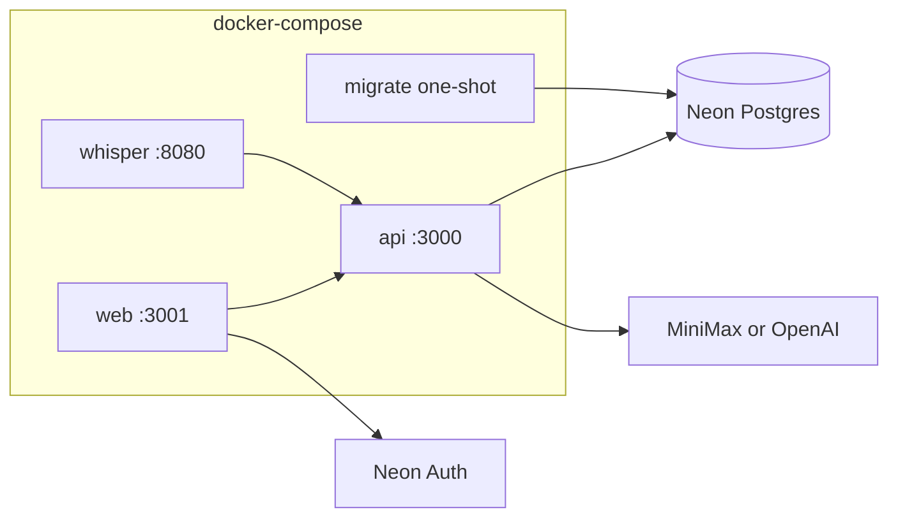

# Docker local development

Run the API, web app, and whisper.cpp transcription server together with hot reload. Neon Postgres and Neon Auth stay **outside** Docker — configure them in the repo root `.env`.

## Prerequisites

- Docker Desktop (or Docker Engine + Compose v2)
- Root `.env` copied from [`.env.example`](../.env.example) with:
  - `DATABASE_URL`, `NEON_AUTH_*`, `NEXT_PUBLIC_NEON_AUTH_URL` (Neon)
  - `AI_PROVIDER` + `MINIMAX_API_KEY` or `OPENAI_API_KEY` (todo extraction)
- HTTPS certificates for the web app (Neon Auth requires HTTPS on localhost)

## Quick start

```bash
cp .env.example .env
# Edit .env with Neon + chat provider keys

# One-time: generate self-signed certs for https://localhost:3001
mkdir -p apps/web/certificates
openssl req -x509 -newkey rsa:2048 -nodes \
  -keyout apps/web/certificates/localhost-key.pem \
  -out apps/web/certificates/localhost.pem \
  -days 365 -subj "/CN=localhost"

npm run docker:dev
```

| Service | URL |
| --- | --- |
| API | http://localhost:3000 |
| Web | https://localhost:3001 |
| whisper.cpp | http://localhost:8080 |

Stop the stack:

```bash
npm run docker:down
```

## What runs in Compose



| Service | Role |
| --- | --- |
| `whisper` | CPU whisper.cpp server; downloads `base.en` model on first start (~150 MB) |
| `migrate` | Runs `npm run db:migrate` once before API starts |
| `api` | Hono dev server with bind-mount hot reload |
| `web` | Next.js HTTPS dev server with bind-mount hot reload |

The API is preconfigured for local transcription:

- `TRANSCRIPTION_PROVIDER=whisper-cpp`
- `WHISPER_CPP_BASE_URL=http://whisper:8080`

You do **not** need `OPENAI_API_KEY` for voice transcription in this stack. Chat/todo extraction still uses your configured `AI_PROVIDER`.

## Verify

```bash
curl http://localhost:3000/health
curl http://localhost:3000/api/ai/status
# Expect: "transcriptionProvider": "whisper-cpp"
```

Voice extract (requires auth JWT in production routes; AI routes may be open — check your setup):

```bash
curl -X POST http://localhost:3000/api/ai/extract/voice \
  -F "audio=@sample.wav"
```

## Troubleshooting

**First whisper start is slow** — model download + load can take several minutes. Watch logs: `docker compose logs -f whisper`.

**Web cert errors in browser** — expected with self-signed certs. Proceed past the warning or use mkcert.

**`migrate` fails** — ensure `DATABASE_URL` in `.env` points to your Neon branch.

**Missing `node_modules` after bind mount** — named volumes preserve container installs. Rebuild: `docker compose down -v && docker compose up --build`.

**Apple Silicon** — whisper image builds for `linux/arm64` natively. On x86 hosts, first whisper build compiles from source (~5–10 min).

## Native dev alternative

Run whisper alone and use native API/web:

```bash
docker compose up whisper
# In .env:
# TRANSCRIPTION_PROVIDER=whisper-cpp
# WHISPER_CPP_BASE_URL=http://127.0.0.1:8080
npm run dev:web-api
```

See also [features/ai-backend.md](./features/ai-backend.md) and [monorepo.md](./monorepo.md).

## Parallel worktrees

To run **multiple Compose stacks** at once (one per git worktree), each with its own Neon branch and ports:

```bash
npm run worktree:bootstrap      # linked worktree only — creates Neon branch + .env.worktree
npm run docker:dev:worktree     # start isolated stack
npm run worktree:list           # ports + URLs for all instances
npm run docker:down:worktree    # stop this worktree's stack
npm run worktree:teardown -- --delete-neon-branch   # optional Neon cleanup
```

Optional [Portless](https://github.com/vercel-labs/portless) URLs: `https://<slug>.quick-capture.localhost` (see [features/worktree-dev.md](./features/worktree-dev.md)).

Main worktree behavior on this page is unchanged (`npm run docker:dev`).
