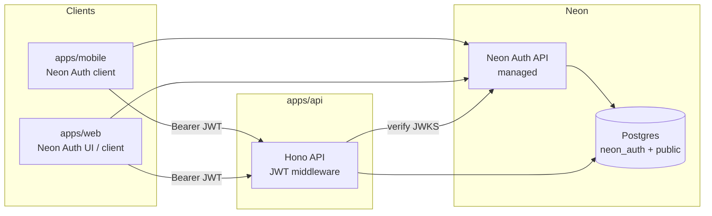

# Authentication (Neon Auth)

**Status:** Planned  
**Phase:** 3a

## Problem

Phase 3 needs account-backed todos, sync, and API push. Users should sign in once and use Quick Capture on **multiple devices** (mobile + web) with the same identity.

## Decision: Neon Auth

Use **[Neon Auth](https://neon.com/docs/auth/overview)** — Neon's managed authentication service built on [Better Auth](https://www.better-auth.com/). Identity lives in the same **Neon Postgres** database as app data (`neon_auth` schema), which aligns with Railway API hosting + Neon database.

### Why Neon Auth (vs self-hosted Better Auth)

| Benefit | Detail |
| --- | --- |
| Managed | No auth server to deploy; Neon runs the Auth REST API in-region |
| Branch-aware | Auth state clones with database branches — safe preview/staging/CI |
| Postgres-native | Users/sessions queryable via SQL; pairs with RLS for row-level security |
| Familiar APIs | Better Auth client; optional `@neondatabase/auth-ui` for web |
| Hono pattern | Official guide: [React + Neon Auth + Hono](https://neon.com/guides/react-neon-auth-hono) |

Self-host Better Auth only if we need unsupported plugins/hooks later.

## Supported sign-in methods

Configure in Neon Console (Project → Branch → Auth) or via `neonctl` MCP:

- [ ] Email + password
- [ ] Google OAuth
- [ ] GitHub OAuth

Trusted domains must include mobile deep links and web origins when configured.

## Architecture



**Flow:**

1. Client signs in via Neon Auth → session + JWT (`sub` = user id)
2. Client calls `apps/api` with `Authorization: Bearer <jwt>`
3. Hono verifies JWT against `{NEON_AUTH_URL}/.well-known/jwks.json` (`jose`)
4. API reads/writes todos scoped to `userId` from JWT `sub`

Mobile and web share the same auth URL for a given Neon branch.

## Implementation by app

### `apps/api` (Hono)

- [ ] `DATABASE_URL` — Neon Postgres (app tables: `todos`, `todo_lists`, `user_devices`, …)
- [ ] Auth middleware — verify Bearer JWT via remote JWKS ([JWT plugin docs](https://neon.com/docs/auth/guides/plugins/jwt))
- [ ] Attach `userId` (`payload.sub`) to request context
- [ ] All sync/capture/device routes require auth

```typescript
// Pattern (see Neon Hono guide)
const JWKS = jose.createRemoteJWKSet(
  new URL(`${process.env.NEON_AUTH_URL}/.well-known/jwks.json`)
);
// jwtVerify(token, JWKS, { issuer: new URL(process.env.NEON_AUTH_URL!).origin })
```

### `apps/mobile` (Expo)

- [ ] `@neondatabase/neon-js/auth` client with `EXPO_PUBLIC_NEON_AUTH_URL`
- [ ] Sign-in / sign-up screens (custom UI or shared web view — TBD)
- [ ] `authClient.token()` → attach to `ai-api-client` and sync requests
- [ ] Secure session storage (expo-secure-store)
- [ ] Register push token after login ([push-notifications.md](./push-notifications.md))

### `apps/web` (planned)

- [ ] `@neondatabase/auth-ui` for sign-in/up (fastest path) or custom Better Auth UI
- [ ] Same `NEON_AUTH_URL` as mobile (per branch)
- [ ] Session cookies for web; JWT for API calls via `authClient.token()`

## Database layout

```
neon_auth.*     — managed by Neon Auth (users, sessions, OAuth config)
public.todos    — app data, user_id FK → neon_auth user id (sub)
public.todo_lists
public.user_devices
```

Use database branches for preview environments; each branch gets its own Auth URL and isolated users.

## Environment variables

| Variable | App | Purpose |
| --- | --- | --- |
| `DATABASE_URL` | api | Neon Postgres connection string |
| `NEON_AUTH_URL` | api | Branch Auth API URL (JWKS issuer) |
| `EXPO_PUBLIC_NEON_AUTH_URL` | mobile | Same Auth URL for client SDK |
| `VITE_NEON_AUTH_URL` / `NEON_AUTH_BASE_URL` | web | Web client auth URL |
| `NEON_AUTH_COOKIE_SECRET` | web | Cookie signing (Next.js/server web only) |

Enable Auth in [Neon Console](https://console.neon.tech) → Project → Branch → Auth. Copy the branch-specific Auth URL.

## Phase 3a checklist

- [ ] Provision Neon project + enable Neon Auth on `main` branch
- [ ] Configure email/password, Google, GitHub providers
- [ ] Drizzle (or similar) migrations for `todos`, `todo_lists` with `user_id`
- [ ] Hono JWT middleware + protected routes
- [ ] Mobile auth screens + token attachment to API client
- [ ] Todo sync endpoints (`POST /api/todos/sync`, CRUD)
- [ ] Sign-out + token refresh handling (JWT expires ~15 min; use `authClient.token()`)

## Security notes

- Never put Neon Auth secrets or `DATABASE_URL` in `EXPO_PUBLIC_*`
- Verify JWT on every protected API route; do not trust client-supplied `userId`
- Provider API keys (`OPENAI_API_KEY`, etc.) remain server-only
- Consider RLS on `public.*` tables keyed to auth user id for defense in depth

## Related

- [PLAN.md](../../PLAN.md) — Phase 3
- [push-notifications.md](./push-notifications.md) — device registration after auth
- [architecture.md](../architecture.md)
- [Neon Auth overview](https://neon.com/docs/auth/overview)
- [Neon Auth + Hono guide](https://neon.com/guides/react-neon-auth-hono)
