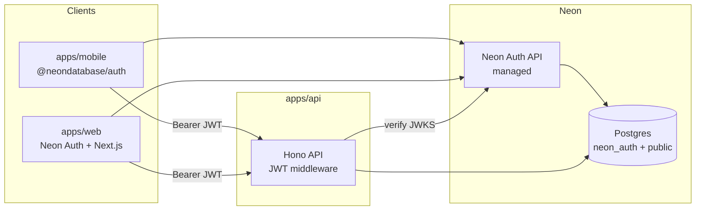

# Authentication (Neon Auth)

**Status:** Shipped (core)  
**Phase:** 3a

## Problem

Phase 3 needs account-backed todos, sync, and API push. Users should sign in once and use Quick Capture on **multiple devices** (mobile + web) with the same identity.

## Decision: Neon Auth

Use **[Neon Auth](https://neon.com/docs/auth/overview)** — Neon's managed authentication service built on [Better Auth](https://www.better-auth.com/). Identity lives in the same **Neon Postgres** database as app data (`neon_auth` schema), which aligns with Railway API hosting + Neon database.

### Why Neon Auth (vs self-hosted Better Auth)

| Benefit | Detail |
| --- | --- |
| Managed | No auth server to deploy; Neon runs the Auth REST API in-region |
| Branch-aware | Auth state clones with database branches — safe preview/staging/CI |
| Postgres-native | Users/sessions queryable via SQL; pairs with RLS for row-level security |
| Familiar APIs | Better Auth client; optional `@neondatabase/auth-ui` for web |
| Hono pattern | Official guide: [React + Neon Auth + Hono](https://neon.com/guides/react-neon-auth-hono) |

Self-host Better Auth only if we need unsupported plugins/hooks later.

## Supported sign-in methods

Configure in Neon Console (Project → Branch → Auth) or via `neonctl`:

- [x] Email + password (web + mobile)
- [ ] Google OAuth
- [ ] GitHub OAuth

Trusted domains must include mobile deep links and web origins when OAuth is configured.

## Architecture



**Flow:**

1. Client signs in via Neon Auth → session + JWT (`userId` on session)
2. Client calls `apps/api` with `Authorization: Bearer <jwt>`
3. Hono verifies JWT against `{NEON_AUTH_URL}/.well-known/jwks.json` (`jose`)
4. API reads/writes todos scoped to `userId` from JWT

Mobile and web share the same auth URL for a given Neon branch.

## Implementation by app

### `apps/api` (Hono) — shipped

- [x] `DATABASE_URL` — Neon Postgres (`todo_lists`, `todos`, `captures`, `user_devices`)
- [x] Auth middleware — verify Bearer JWT via remote JWKS
- [x] Attach `userId` to request context
- [x] Protected routes: lists, todos, captures, devices
- [ ] Require auth on AI routes (optional hardening)

Implementation: `apps/api/src/middleware/auth.ts`

### `apps/mobile` (Expo) — shipped

- [x] `@neondatabase/auth` client with `EXPO_PUBLIC_NEON_AUTH_URL`
- [x] Sign-in / sign-up modal (`app/sign-in.tsx`)
- [x] `AuthProvider` context — session, sign-out
- [x] JWT attached to sync + AI API requests (`sync-api-client.ts`, `ai-api-client.ts`)
- [x] Push local todos to server before pull on sign-in (`todo-sync.ts`)
- [x] CRUD sync to API when signed in (todos, lists, reminders)
- [x] Register Expo push token after login
- [ ] `expo-secure-store` for session persistence hardening
- [ ] OAuth sign-in (depends on Neon Console config)

Key files: `services/auth-client.ts`, `contexts/auth-provider.tsx`, `services/todo-sync.ts`

### `apps/web` — shipped

- [x] Neon Auth via `@neondatabase/auth/next`
- [x] Custom sign-in / sign-up forms (shadcn)
- [x] Session cookies + JWT for API calls (`session.token`)
- [x] Middleware protects `(app)` routes

Key files: `lib/auth/server.ts`, `lib/auth/client.ts`, `middleware.ts`

## Mobile sync flow

On sign-in (`syncOnSignIn`):

1. Enable server reminder mode (skip local `expo-notifications` scheduling)
2. Clear any locally scheduled notifications
3. **Push** local lists/todos missing on the server (`clientId` preserves todo IDs)
4. **Pull** canonical cloud state into SQLite
5. Register Expo push device

While signed in, all todo/list CRUD operations mirror to the API. Sign-out returns to offline-only local mode.

## Database layout

```
neon_auth.*     — managed by Neon Auth (users, sessions, OAuth config)
public.todo_lists
public.todos    — user_id scoped; reminder_at, reminder_sent_at
public.captures
public.user_devices
```

Use database branches for preview environments; each branch gets its own Auth URL and isolated users.

## Environment variables

| Variable | App | Purpose |
| --- | --- | --- |
| `DATABASE_URL` | api | Neon Postgres connection string |
| `NEON_AUTH_URL` | api | Branch Auth API URL (JWKS issuer) |
| `EXPO_PUBLIC_NEON_AUTH_URL` | mobile | Same Auth URL for client SDK |
| `NEON_AUTH_BASE_URL` / `NEXT_PUBLIC_NEON_AUTH_URL` | web | Web client auth URL |
| `NEON_AUTH_COOKIE_SECRET` | web | Cookie signing (Next.js server) |
| `CORS_ORIGINS` | api | Web (`3001`) + Expo (`8081`) origins |

Enable Auth in [Neon Console](https://console.neon.tech) → Project → Branch → Auth. Copy the branch-specific Auth URL.

## Phase 3a checklist

- [x] Drizzle migrations for `todos`, `todo_lists`, `captures`, `user_devices`
- [x] Hono JWT middleware + protected routes
- [x] Web auth pages + session
- [x] Mobile auth screens + token attachment to API client
- [x] Todo CRUD + list CRUD via REST (no separate bulk sync endpoint yet)
- [x] Sign-out handling
- [ ] Provision Neon + enable OAuth providers in Console
- [ ] RLS on `public.*` tables (defense in depth)

## Security notes

- Never put Neon Auth secrets or `DATABASE_URL` in `EXPO_PUBLIC_*`
- Verify JWT on every protected API route; do not trust client-supplied `userId`
- Provider API keys (`OPENAI_API_KEY`, etc.) remain server-only
- Consider RLS on `public.*` tables keyed to auth user id for defense in depth

## Related

- [PLAN.md](../../PLAN.md) — Phase 3
- [web-app.md](./web-app.md) — web companion
- [push-notifications.md](./push-notifications.md) — device registration after auth
- [architecture.md](../architecture.md)
- [Neon Auth overview](https://neon.com/docs/auth/overview)
- [Neon Auth + Hono guide](https://neon.com/guides/react-neon-auth-hono)
