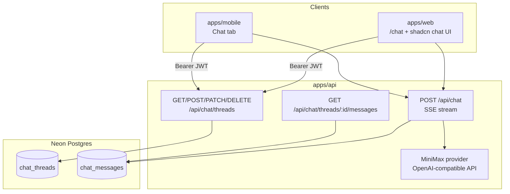

# MiniMax agent chat

**Status:** In progress (v1 core shipped)  
**Phase:** 6

## Problem

Quick Capture excels at turning captures into todos, but users still context-switch to other apps when they want to **think out loud**, plan a day, or ask questions about their lists. A built-in assistant keeps planning inside the product and can eventually bridge chat → todos without bypassing review.

Today the API only exposes **one-shot extraction** (`/api/ai/extract/*`). There is no conversational endpoint, no thread storage, and no chat UI on mobile or web.

## Goal

Add a **Chat** tab (mobile) and **Chat** route (web) where signed-in users talk to a **MiniMax agent** (MiniMax-M2.5). Conversations are **persisted in Neon Postgres**, synced across devices, and streamed in real time.

### Non-goals (v1)

- Voice input inside chat (use existing Voice tab)
- Agent writing todos directly to the database (suggestions only; user confirms via review flow in a later slice)
- Multi-user / shared threads
- Tool calling against the API (planned v1.1+)

## Architecture



**Flow:**

1. User opens Chat → client loads thread list from API.
2. User sends a message → client `POST /api/chat` with `{ threadId?, message }`.
3. API persists the user message, streams MiniMax tokens via **SSE**, persists the assistant message on completion, updates thread `updatedAt` (and title if new thread).
4. Other devices see the thread on next list fetch or when opening the thread.

Chat routes are **auth-required** (same JWT middleware as lists/todos). Unlike capture extraction, chat is account-backed only — no offline/mock mode in v1.

## Agent

### Provider

Chat always uses **MiniMax** (`MINIMAX_API_KEY`, `MINIMAX_CHAT_MODEL`, default `MiniMax-M2.5`), independent of `AI_PROVIDER` used for capture extraction. This keeps the product agent consistent while extraction can remain on OpenAI.

Add `assertMiniMaxChatConfigured()` in `apps/api/src/ai/config.ts` for chat routes.

### System prompt (v1)

The agent is a Quick Capture assistant. It should:

- Help users plan, prioritize, and break down work
- Explain how capture → review → todo flows work
- Suggest concrete todo titles when asked (plain text; no JSON tool output in v1)
- Never claim it created, edited, or deleted todos in the app
- Stay concise; ask clarifying questions when the request is ambiguous

Store the prompt in `apps/api/src/ai/prompts.ts` as `CHAT_AGENT_SYSTEM_PROMPT`.

### Context assembly

When streaming a reply, the API builds MiniMax messages as:

1. System prompt (fixed)
2. Last *N* persisted messages for the thread (see trimming below)
3. New user message (already persisted before stream starts)

Optional v1.1: inject a lightweight summary of the user's open todos (count + top titles) into the system prompt when the user asks list-related questions — not required for v1.

### Title generation

New threads start with title `"New chat"`. After the first assistant reply completes, generate a short title (≤ 60 chars) via a non-streaming MiniMax call using the first user message. Patch `chat_threads.title` asynchronously; client refetches thread list or applies optimistic update.

## Data model

Drizzle tables in `apps/api/src/db/schema.ts`:

```typescript
type ChatThread = {
  id: string;           // createId()
  userId: string;
  title: string;
  createdAt: string;    // ISO timestamptz
  updatedAt: string;
};

type ChatMessageRole = 'user' | 'assistant';

type ChatMessage = {
  id: string;
  threadId: string;
  role: ChatMessageRole;
  content: string;
  createdAt: string;
  metadata?: {
    model?: string;
    finishReason?: string;
    error?: string;
  };
};
```

Indexes:

- `idx_chat_threads_user_id` on `chat_threads.userId`
- `idx_chat_threads_user_updated` on `(userId, updatedAt DESC)` for sidebar sort
- `idx_chat_messages_thread_id` on `chat_messages.threadId`
- `idx_chat_messages_thread_created` on `(threadId, createdAt ASC)` for pagination

Cascade: deleting a thread deletes its messages.

## Shared schemas

Add `packages/shared/src/chat-schemas.ts` (export from package index):

| Schema | Purpose |
| --- | --- |
| `chatMessageRoleSchema` | `'user' \| 'assistant'` |
| `chatThreadSchema` | Thread DTO |
| `chatMessageSchema` | Message DTO |
| `createChatThreadSchema` | `{ title?: string }` |
| `updateChatThreadSchema` | `{ title: string }` |
| `listChatThreadsResponseSchema` | `{ threads: ChatThread[] }` |
| `listChatMessagesResponseSchema` | `{ messages: ChatMessage[]; nextCursor?: string }` |
| `chatRequestSchema` | `{ threadId?: string; message: string }` |

Rebuild shared after changes: `npm run build --workspace=@quick-capture/shared`.

## API

All routes under `/api/chat`, protected by `authMiddleware` + database configured check (same pattern as `lists.ts`).

| Method | Path | Body | Response |
| --- | --- | --- | --- |
| GET | `/api/chat/threads` | — | `{ threads: ChatThread[] }` sorted by `updatedAt` desc |
| POST | `/api/chat/threads` | `{ title?: string }` | `{ thread: ChatThread }` 201 |
| PATCH | `/api/chat/threads/:id` | `{ title: string }` | `{ thread: ChatThread }` |
| DELETE | `/api/chat/threads/:id` | — | 204 |
| GET | `/api/chat/threads/:id/messages` | query: `cursor?`, `limit?` (default 50) | `{ messages, nextCursor? }` |
| POST | `/api/chat` | `{ threadId?: string, message: string }` | **SSE** stream (see below) |

Register in `apps/api/src/index.ts`: `app.route('/api/chat', chatRoutes)`.

### Streaming (`POST /api/chat`)

Uses **Server-Sent Events** compatible with [Vercel AI SDK](https://sdk.vercel.ai/docs) `useChat` / `streamText` data stream format, or a documented minimal SSE shape if we skip the SDK on the server.

**Server steps:**

1. Validate body with `chatRequestSchema`.
2. Resolve or create thread (must belong to `userId`).
3. Insert user message row.
4. Open MiniMax streaming `chat/completions` (`stream: true`).
5. Pipe tokens to client; on finish, insert assistant message row; update thread `updatedAt`; trigger title generation if needed.
6. On provider error mid-stream, emit error event, persist partial assistant message with `metadata.error` if any content was streamed.

**Client headers:** `Authorization: Bearer <jwt>`, `Content-Type: application/json`, `Accept: text/event-stream`.

### Context trimming

Cap history sent to MiniMax at **40 messages** or ~12k estimated tokens (whichever stricter). Always include the most recent messages. Log when trimming occurs (debug).

### Rate limiting (v1)

Simple in-process limit: **30 chat requests / user / hour**. Return `429` with `Retry-After`. Replace with Redis or edge limiter in production if needed.

## Web (`apps/web`)

### Stack additions

Install [June 2026 shadcn chat components](https://ui.shadcn.com/docs/changelog/2026-06-chat-components):

```bash
cd apps/web
pnpm dlx shadcn@latest add message-scroller message bubble attachment marker
```

Add dependencies:

- `ai` + `@ai-sdk/react` — streaming client (`useChat`)
- Markdown renderer for assistant bubbles (e.g. `react-markdown` + `remark-gfm`) if not included in Bubble

`scroll-fade` and `shimmer` utilities ship with shadcn/tailwind.css (already initialized).

### Routes

| Route | Purpose |
| --- | --- |
| `/chat` | Thread list + empty/new conversation pane |
| `/chat/[threadId]` | Active thread |

Add **Chat** to `AppShell` nav (`app-shell.tsx`), between Voice and Devices.

### UI composition

```
┌─────────────────────────────────────────────────────┐
│ AppShell header                                     │
├──────────────┬──────────────────────────────────────┤
│ Thread       │ MessageScroller                      │
│ sidebar      │   Message + Bubble (user / assistant)│
│ - New chat   │   Marker (thinking, errors, dates)   │
│ - Search     │                                      │
│ - Thread …   │ Composer (textarea + send)           │
└──────────────┴──────────────────────────────────────┘
```

| Component | Usage |
| --- | --- |
| `MessageScroller` | Scroll container; anchored turns; auto-follow during MiniMax stream; restore scroll on thread switch |
| `Message` | Row layout (avatar, alignment, header/footer) |
| `Bubble` | Message surface; markdown body; user vs assistant variants |
| `Marker` | `"Thinking…"` with `shimmer` while waiting; error retry; date separators |
| `Attachment` | **v1.1** — image uploads in chat |

### Client modules

| Module | Purpose |
| --- | --- |
| `lib/chat-client.ts` | Thread CRUD, message fetch, SSE stream helper |
| `hooks/use-chat-threads.ts` | TanStack Query for thread list |
| `components/chat-thread-sidebar.tsx` | Thread list, search, new/rename/delete |
| `components/chat-conversation.tsx` | MessageScroller + composer + useChat |
| `app/(app)/chat/page.tsx` | Layout: sidebar + empty state |
| `app/(app)/chat/[threadId]/page.tsx` | Active thread |

Auth: reuse `getAccessToken()` from `lib/api-client-client.ts` pattern; attach JWT to chat API calls.

### UX requirements

- Empty state: “How can I help you today?” + suggested prompts (plan my day, break down a project, explain Quick Capture)
- Loading skeletons for thread list and message history
- Retry button on failed streams (resend last user message or continue)
- Optimistic user bubble on send
- Mobile-responsive: collapse sidebar to drawer below `md` breakpoint

## Mobile (`apps/mobile`)

### Navigation

- Add **Chat** tab in `app/(tabs)/_layout.tsx` (icon: `bubble.left.and.bubble.right` / `chat`)
- `app/(tabs)/chat.tsx` — thread list (signed-in) or sign-in prompt
- `app/chat/[threadId].tsx` — stack screen for active thread (pushed from list)

Sign-in required (same as cloud sync). When logged out, show CTA linking to `/sign-in`.

### UI

Mirror web capabilities without shadcn — native React Native:

| Element | Implementation |
| --- | --- |
| Thread list | `FlatList` sorted by `updatedAt`; swipe-to-delete |
| Message list | Inverted `FlatList` or `ScrollView` with stick-to-bottom during stream (parity with `MessageScroller` behavior) |
| Bubbles | User right-aligned (system blue), assistant left-aligned (secondary background) |
| Streaming | Append tokens to last assistant bubble; pulsing “…” marker while waiting |
| Composer | `TextInput` + send button; disable while streaming |
| Markdown | Lightweight renderer (e.g. `react-native-markdown-display`) for assistant messages |

### Client

| Module | Purpose |
| --- | --- |
| `services/chat-api-client.ts` | Thread CRUD, SSE consumer (fetch + ReadableStream or EventSource polyfill) |
| `hooks/use-chat-threads.ts` | Thread list state |
| `hooks/use-chat-messages.ts` | Messages + streaming for active thread |
| `components/chat-thread-list.tsx` | Thread list UI |
| `components/chat-message-list.tsx` | Bubbles + markers |
| `components/chat-composer.tsx` | Input + send |

**Optional v1.1:** cache recent threads in `expo-sqlite` for instant open; reconcile with API on launch (same pattern as todo sync, but threads are API-only in v1).

## Security and privacy

- All chat data scoped to `userId` from JWT; 404 if thread not owned
- MiniMax API key server-only (never `EXPO_PUBLIC_*` / `NEXT_PUBLIC_*`)
- Do not log message content at info level in production
- Chat history deleted when user deletes thread (hard delete v1)

## Environment

No new secrets beyond existing MiniMax vars. Optional tuning:

| Variable | Default | Purpose |
| --- | --- | --- |
| `MINIMAX_CHAT_MODEL` | `MiniMax-M2.5` | Agent model |
| `CHAT_MAX_HISTORY_MESSAGES` | `40` | Context window cap |
| `CHAT_RATE_LIMIT_PER_HOUR` | `30` | Per-user chat requests |

## Code locations (planned)

| Area | Path |
| --- | --- |
| Shared schemas | `packages/shared/src/chat-schemas.ts` |
| DB schema + migration | `apps/api/src/db/schema.ts`, `apps/api/drizzle/0006_chat.sql` |
| Chat routes | `apps/api/src/routes/chat.ts` |
| MiniMax stream helper | `apps/api/src/ai/chat-stream.ts` |
| System prompt | `apps/api/src/ai/prompts.ts` |
| Web UI | `apps/web/src/app/(app)/chat/`, `apps/web/src/components/chat-*` |
| Mobile UI | `apps/mobile/app/(tabs)/chat.tsx`, `apps/mobile/app/chat/`, `apps/mobile/components/chat-*` |

## Implementation checklist

### 6.1 — Data model and API

- [x] Drizzle schema + migration for `chat_threads`, `chat_messages`
- [x] Shared Zod + TypeScript types
- [x] Thread CRUD + message list routes
- [x] Streaming `POST /api/chat` via MiniMax SSE
- [x] Persist messages; auto-title new threads
- [x] Context trimming + rate limiting

### 6.2 — Web chat

- [x] Install shadcn chat components
- [x] `/chat` routes and app shell nav
- [x] Thread sidebar (new, search, delete)
- [x] MessageScroller + Message + Bubble + Marker
- [x] Attachment — image upload in composer; vision messages to MiniMax (v1.1)
- [x] SSE streaming client against API
- [x] Empty, loading, and error states

### 6.3 — Mobile chat tab

- [x] Chat tab + thread list + thread detail routes
- [x] Streaming message UI with stick-to-bottom
- [x] `chat-api-client.ts` + hooks
- [x] Sign-in gate when logged out

### 6.4 — Agent polish

- [x] Quick Capture system prompt
- [ ] Cross-device sync verified (manual QA)
- [x] Accessibility (labels, reduced motion, stream retry)
- [x] **Future:** “Add as todos” → review modal ([review-before-save convention](../architecture.md))

## Acceptance criteria

- [ ] Signed-in user can start a new chat on web and mobile
- [ ] Assistant replies stream token-by-token from MiniMax
- [ ] Threads and messages persist; visible on another device after sign-in
- [ ] User can rename and delete threads
- [ ] Web uses shadcn `MessageScroller`, `Message`, `Bubble`, and `Marker`
- [ ] Scroll position stays anchored during streaming (no jumpiness)
- [ ] Unauthorized and cross-user thread access return 401/404
- [ ] Chat unavailable when `MINIMAX_API_KEY` missing (clear error, not silent failure)

## Future slices

| Slice | Description |
| --- | --- |
| **Attachments** | Image upload in chat via shadcn `Attachment`; vision messages to MiniMax |
| **Todo actions** | Parse assistant suggestions → `review-todos` flow (shipped) |
| **Todo context** | Inject open todos into system prompt for list-aware answers |
| **Search** | Full-text search across thread titles and messages |
| **Export** | Export thread as markdown |

## Related

- [PLAN.md](../../PLAN.md) — Phase 6
- [ai-backend.md](./ai-backend.md) — MiniMax provider, env vars
- [auth.md](./auth.md) — JWT, Neon Auth
- [web-app.md](./web-app.md) — Next.js companion, shadcn stack
- [architecture.md](../architecture.md) — review-before-save for AI todos
