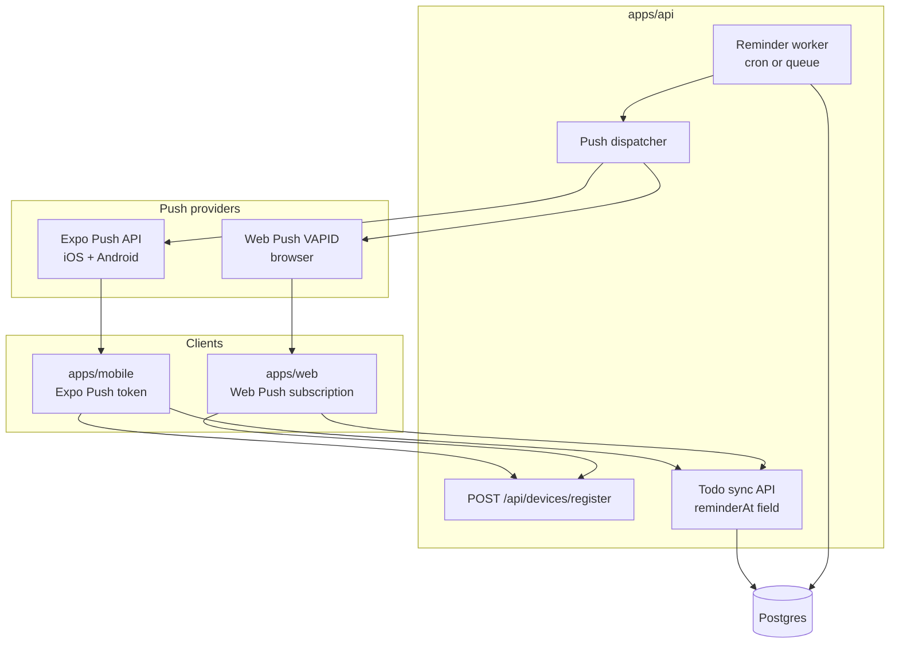

# Push notifications (API-backed)

**Status:** Planned  
**Phase:** 3

## Problem

Phase 2.5 reminders are **local only** — scheduled on each device via `expo-notifications`. That breaks down when:

- The user has **multiple devices** (phone + tablet + web)
- The app is **reinstalled** before the reminder fires
- A **web app** needs reminders without a native scheduler
- Todos **sync from the cloud** and reminders should follow the account, not one phone

## Goal

The **API owns reminder delivery**. When `reminderAt` passes, the server sends a push to **every registered device** for that user. Clients register push tokens after auth; they do not schedule OS notifications for synced todos (local scheduling remains an offline fallback until sync is active).

## Architecture



## Multi-device model

One user, many devices. Each device registers independently.

```typescript
type DevicePlatform = 'ios' | 'android' | 'web';

type UserDevice = {
  id: string;
  userId: string;
  platform: DevicePlatform;
  pushToken: string;       // Expo push token OR web push endpoint JSON
  pushProvider: 'expo' | 'web-push';
  deviceName?: string;     // "Andre's iPhone", "Chrome on MacBook"
  lastSeenAt: string;
  createdAt: string;
};
```

**On reminder fire:** send to all devices where `lastSeenAt` is within 90 days (configurable). User gets the same reminder on phone and web unless they revoke a device.

**Duplicate prevention during migration:**

| Mode | Who schedules |
| --- | --- |
| Offline / not signed in | Client local (`expo-notifications`) — current behavior |
| Signed in + synced | Server only; client skips local schedule for synced todos |
| Signed in + offline edit | Queue sync; server schedules after push |

## Data model (server)

Extends todo sync from Phase 3:

```sql
-- todos (server)
reminder_at TIMESTAMPTZ,
reminder_sent_at TIMESTAMPTZ,   -- idempotency: don't double-send
updated_at TIMESTAMPTZ

-- user_devices
id, user_id, platform, push_token, push_provider, device_name, last_seen_at, created_at

-- reminder_jobs (optional explicit queue; or query todos where reminder_at <= now())
id, todo_id, user_id, scheduled_for, status, attempts, last_error
```

**Client `notificationId`** stays device-local and is **not synced**. Server uses `reminder_sent_at` instead.

## API endpoints (Phase 3)

| Method | Path | Purpose |
| --- | --- | --- |
| POST | `/api/devices/register` | Register or refresh push token |
| DELETE | `/api/devices/:id` | Revoke device (logout, uninstall) |
| GET | `/api/devices` | List user's devices (settings UI) |
| PATCH | `/api/todos/:id` | Includes `reminderAt` |
| POST | `/api/todos/sync` | Bulk sync with `reminderAt` |

Device registration body (shared Zod):

```typescript
{
  platform: 'ios' | 'android' | 'web',
  pushToken: string,
  pushProvider: 'expo' | 'web-push',
  deviceName?: string
}
```

## Push providers by platform

| Platform | Provider | Token type |
| --- | --- | --- |
| iOS (Expo) | [Expo Push API](https://docs.expo.dev/push-notifications/sending-notifications/) | `ExponentPushToken[...]` |
| Android (Expo) | Expo Push API | Same |
| Web | [Web Push](https://developer.mozilla.org/en-US/docs/Web/API/Push_API) + VAPID | `PushSubscription` JSON |

**Why not FCM-only?** Expo apps integrate cleanly with Expo Push; web uses standard Web Push. The API `PushDispatcher` abstracts both:

```typescript
interface PushDispatcher {
  sendReminder(userId: string, devices: UserDevice[], payload: ReminderPayload): Promise<void>;
}
```

## Reminder worker

Runs in `apps/api` (or separate worker process on Railway):

1. Every minute (or use pg_cron / BullMQ): query todos where `reminder_at <= now()` AND `reminder_sent_at IS NULL` AND `completed = false`
2. For each todo: load user's devices → dispatch push
3. Set `reminder_sent_at = now()` (idempotent)
4. On complete/delete: clear `reminder_at` server-side; no job needed

**Payload:**

```json
{
  "title": "Todo reminder",
  "body": "Call mom tomorrow",
  "data": { "todoId": "...", "listId": "..." }
}
```

## Client changes (by app)

### Mobile (`apps/mobile`) — Phase 3b

- [ ] After auth: `Notifications.getExpoPushTokenAsync()` → `POST /api/devices/register`
- [ ] On token refresh / app launch: re-register
- [ ] When synced todo sets `reminderAt`: **do not** call local `scheduleReminder` (server handles)
- [ ] Keep local scheduler for offline-only users
- [ ] Handle incoming push tap → deep link to todo

### Web (`apps/web`) — Phase 3c / 4

- [ ] Service worker + `PushManager.subscribe(VAPID_PUBLIC_KEY)`
- [ ] Register subscription with API (`pushProvider: 'web-push'`)
- [ ] Same todo/reminder UI; no local OS scheduler
- [ ] Notification click → open `/todos/:id`

Planned location: `apps/web` in monorepo (Next.js or Expo web export — TBD).

## Environment variables (API)

```bash
# Push — Expo (mobile)
EXPO_ACCESS_TOKEN=          # Expo push security (optional but recommended)

# Push — Web Push (VAPID)
VAPID_PUBLIC_KEY=
VAPID_PRIVATE_KEY=
VAPID_SUBJECT=mailto:you@example.com

# Worker
REMINDER_POLL_INTERVAL_MS=60000
```

## Shared types

Add to `packages/shared`:

- `devicePlatformSchema`, `registerDeviceSchema`
- `pushProviderSchema`
- Extend sync schemas (already has `reminderAt`)

## Implementation phases

### Phase 3a — Neon Auth + todo sync

- Prerequisite for push; provision Neon Auth + Postgres; `reminderAt` syncs to Neon
- Spec: [auth.md](./auth.md)

### Phase 3b — API push (mobile)

- [ ] `user_devices` table + register endpoint
- [ ] Reminder worker + Expo Push dispatcher
- [ ] Mobile token registration after login
- [ ] Disable local schedule when account synced

### Phase 3c — Web app + Web Push

- [ ] Scaffold `apps/web`
- [ ] Service worker push subscription
- [ ] Web Push dispatcher in API
- [ ] Multi-device: phone + browser both receive reminder

### Phase 3d — Polish

- [ ] Device management screen ("where you're signed in")
- [ ] Per-device mute (optional)
- [ ] Snooze from notification (server reschedules `reminder_at`)

## Acceptance criteria

- [ ] User signed in on iPhone + web → both get reminder at `reminderAt`
- [ ] Complete todo on any device → no reminder fires on any device
- [ ] Reinstall mobile app, sign in → future reminders work without local reconcile
- [ ] Offline user without account → local reminders still work (Phase 2.5)
- [ ] Invalid/expired tokens pruned; no send loops

## Related

- [auth.md](./auth.md) — Neon Auth (Phase 3a)
- [scheduled-reminders.md](./scheduled-reminders.md) — Phase 2.5 local implementation
- [PLAN.md](../../PLAN.md) — Phase 3 roadmap
- [architecture.md](../architecture.md)
