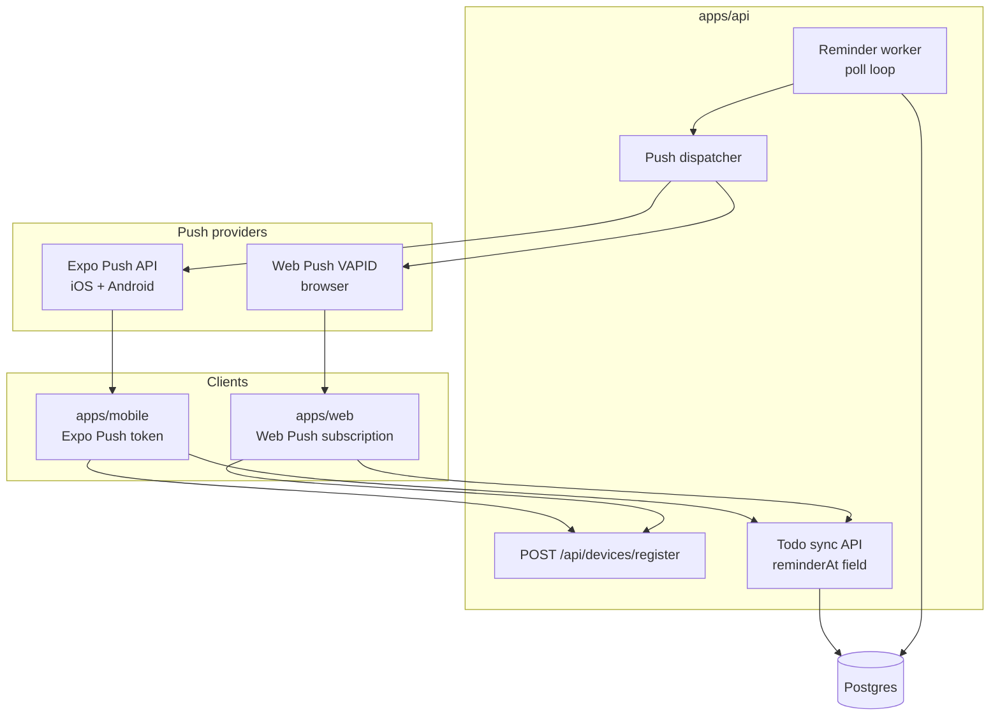

# Push notifications (API-backed)

**Status:** Shipped (core)  
**Phase:** 3

## Problem

Phase 2.5 reminders are **local only** — scheduled on each device via `expo-notifications`. That breaks down when:

- The user has **multiple devices** (phone + tablet + web)
- The app is **reinstalled** before the reminder fires
- A **web app** needs reminders without a native scheduler
- Todos **sync from the cloud** and reminders should follow the account, not one phone

## Goal

The **API owns reminder delivery**. When `reminderAt` passes, the server sends a push to **every registered device** for that user. Clients register push tokens after auth; they do not schedule OS notifications for synced todos (local scheduling remains an offline fallback until sync is active).

## Architecture



## Multi-device model

One user, many devices. Each device registers independently.

```typescript
type DevicePlatform = 'ios' | 'android' | 'web';

type UserDevice = {
  id: string;
  userId: string;
  platform: DevicePlatform;
  pushToken: string;       // Expo push token OR web push endpoint JSON
  pushProvider: 'expo' | 'web-push';
  deviceName?: string;     // "Chrome", "ios device"
  lastSeenAt: string;
  createdAt: string;
};
```

**On reminder fire:** send to all devices where `lastSeenAt` is within 90 days. User gets the same reminder on phone and web unless they revoke a device.

**Duplicate prevention during migration:**

| Mode | Who schedules |
| --- | --- |
| Offline / not signed in | Client local (`expo-notifications`) — Phase 2.5 behavior |
| Signed in + synced | Server only; client skips local `scheduleReminder` |
| Signed in + offline edit | Changes sync to API; server schedules after `reminderAt` is set |

## Data model (server)

```sql
-- todos (server)
reminder_at TIMESTAMPTZ,
reminder_sent_at TIMESTAMPTZ,   -- idempotency: don't double-send

-- user_devices
id, user_id, platform, push_token, push_provider, device_name, last_seen_at, created_at
```

**Client `notificationId`** stays device-local and is **not synced**. Server uses `reminder_sent_at` instead.

## API endpoints

| Method | Path | Purpose | Status |
| --- | --- | --- | --- |
| POST | `/api/devices/register` | Register or refresh push token | ✅ |
| DELETE | `/api/devices/:id` | Revoke device | ✅ |
| GET | `/api/devices` | List user's devices | ✅ |
| PATCH | `/api/todos/:id` | Includes `reminderAt`; clears on complete | ✅ |

Device registration body (shared Zod in `packages/shared`):

```typescript
{
  platform: 'ios' | 'android' | 'web',
  pushToken: string,
  pushProvider: 'expo' | 'web-push',
  deviceName?: string
}
```

## Push providers by platform

| Platform | Provider | Token type |
| --- | --- | --- |
| iOS (Expo) | [Expo Push API](https://docs.expo.dev/push-notifications/sending-notifications/) | `ExponentPushToken[...]` |
| Android (Expo) | Expo Push API | Same |
| Web | [Web Push](https://developer.mozilla.org/en-US/docs/Web/API/Push_API) + VAPID | `PushSubscription` JSON |

The API `push-dispatcher.ts` abstracts both Expo and Web Push.

## Reminder worker

Runs in `apps/api` on startup (`startReminderWorker`):

1. Poll every `REMINDER_POLL_INTERVAL_MS` (default 60s): query todos where `reminder_at <= now()` AND `reminder_sent_at IS NULL` AND `completed = false`
2. For each todo: load user's active devices → dispatch push
3. Set `reminder_sent_at = now()` (idempotent)
4. On complete: API clears `reminder_at` and `reminder_sent_at`

**Payload:**

```json
{
  "title": "Todo reminder",
  "body": "Call mom tomorrow",
  "data": { "todoId": "...", "listId": "..." }
}
```

## Client implementation

### Mobile (`apps/mobile`) — shipped

- [x] After auth: `Notifications.getExpoPushTokenAsync()` → `POST /api/devices/register`
- [x] Re-register on sign-in via `AuthProvider`
- [x] When synced: skip local `scheduleReminder` (`isServerRemindersEnabled()`)
- [x] `reminderAt` changes sync via `PATCH /api/todos/:id`
- [x] Local scheduler remains for offline-only users
- [ ] Handle incoming push tap → deep link to todo

Key files: `services/register-push-device.ts`, `services/reminder-scheduler.ts`, `services/sync-mode.ts`

### Web (`apps/web`) — shipped

- [x] Service worker (`public/sw.js`) + `PushManager.subscribe(VAPID_PUBLIC_KEY)`
- [x] Register subscription with API (`pushProvider: 'web-push'`)
- [x] Auto-subscribe after sign-in (`PushRegistration` component)
- [x] Device management UI at `/devices`
- [ ] Notification click → open highlighted todo on `/`

Key files: `lib/push-notifications.ts`, `components/push-registration.tsx`, `components/devices-page-client.tsx`

## Environment variables

```bash
# Push — Expo (mobile)
EXPO_ACCESS_TOKEN=          # Optional but recommended

# Push — Web Push (VAPID) — API
VAPID_PUBLIC_KEY=
VAPID_PRIVATE_KEY=
VAPID_SUBJECT=mailto:you@example.com

# Web client (same public key)
NEXT_PUBLIC_VAPID_PUBLIC_KEY=

# Worker
REMINDER_POLL_INTERVAL_MS=60000
```

Generate keys: `npx web-push generate-vapid-keys`

## Shared types (shipped)

In `packages/shared/src/api-schemas.ts`:

- `devicePlatformSchema`, `registerDeviceSchema`, `pushProviderSchema`

## Remaining polish

- [ ] Per-device mute (optional)
- [ ] Snooze from notification (server reschedules `reminder_at`)
- [ ] Prune invalid/expired push tokens automatically
- [ ] Separate worker process on Railway (optional; currently in-process poll)

## Acceptance criteria

- [x] User signed in on mobile + web → both can register for push
- [x] Complete todo on any device → API clears reminder (no fire)
- [x] Reinstall mobile app, sign in → register push token for future reminders
- [x] Offline user without account → local reminders still work (Phase 2.5)
- [ ] End-to-end verified: both devices receive reminder at `reminderAt` (requires VAPID + EAS projectId)
- [ ] Invalid/expired tokens pruned; no send loops

## Related

- [auth.md](./auth.md) — Neon Auth (prerequisite)
- [scheduled-reminders.md](./scheduled-reminders.md) — Phase 2.5 local implementation
- [web-app.md](./web-app.md) — web companion
- [PLAN.md](../../PLAN.md) — Phase 3 roadmap
- [architecture.md](../architecture.md)
