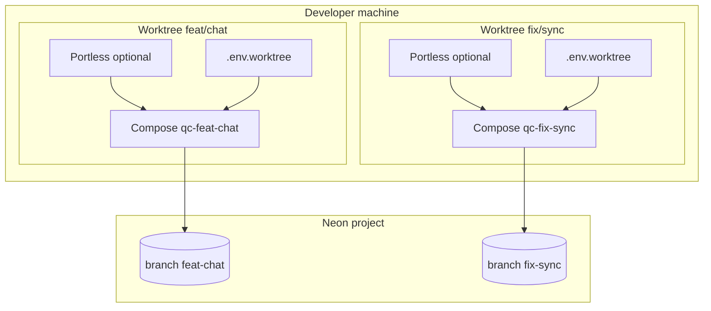

# Parallel worktree development

**Status:** In progress (9.1–9.3 core shipped)  
**Phase:** 9

## Problem

Quick Capture’s [Docker Compose stack](../docker-dev.md) assumes **one checkout, one `.env`, fixed ports** (`3000` API, `3001` web, `8080` whisper). That breaks down when you use **git worktrees** to work on multiple features at once:

| Collision | Symptom |
| --- | --- |
| Host ports already bound | Second `docker compose up` fails or attaches to the wrong stack |
| Shared `DATABASE_URL` / `NEON_AUTH_*` | Migrations and test data from branch A overwrite branch B |
| Wrong `NEXT_PUBLIC_API_URL` / `CORS_ORIGINS` | Web in worktree A calls API in worktree B |
| `localhost:3001` everywhere | Hard to tell which instance you’re debugging |

Neon already supports **database branches** with isolated auth ([auth.md](./auth.md#preview--staging-branches)). This spec wires branch-per-worktree into Docker Compose and optional [Portless](https://github.com/vercel-labs/portless) URLs.

## Goal

From any linked worktree, run a **fully isolated dev stack**:

- Own **Neon Postgres + Auth** branch
- Own **Docker Compose project** and volumes
- Own **host port block** (no collisions)
- Optional **stable HTTPS URLs** (`feat-chat.quick-capture.localhost`) via Portless worktree detection

The **main worktree** keeps today’s defaults (`npm run docker:dev` → ports `3000`/`3001`/`8080`).

### Non-goals

- CI / Vercel preview automation (use Neon preview branches + Vercel env — see [auth.md](./auth.md))
- Running multiple Expo dev servers on one device without manual `EXPO_PUBLIC_*` (documented, not scripted)
- Production multi-tenancy

## Architecture



### Isolation layers

| Layer | Mechanism | Example |
| --- | --- | --- |
| Git | `git worktree add` | `../quick-capture-feat-chat` on `feat/chat` |
| Neon | Branch per worktree slug | `feat-chat` cloned from `main` |
| Auth | Branch-matched URLs | `NEON_AUTH_URL` for that branch only |
| Docker | `COMPOSE_PROJECT_NAME` | `qc-feat-chat` |
| Ports | Deterministic block per slug | API `3010`, web `3011`, whisper `8082` |
| URLs | Portless worktree prefix | `https://feat-chat.quick-capture.localhost` |

## Worktree slug

Branch names map to URL-safe slugs used everywhere (Compose project, Neon branch name, Portless subdomain):

| Git branch | Slug |
| --- | --- |
| `feat/chat` | `feat-chat` |
| `fix/sync-conflicts` | `fix-sync-conflicts` |
| `main` | `main` (main worktree uses default ports, no prefix) |

Rules:

- Lowercase
- `/` → `-`
- Strip characters outside `[a-z0-9-]`
- Max length 63 (DNS label limit)
- Script: `scripts/worktree-slug.sh` or `npm run worktree:slug`

## Port allocation

Default ports (main worktree only):

| Service | Port |
| --- | --- |
| API | `3000` |
| Web | `3001` |
| whisper | `8080` |

Worktree port block (deterministic, collision-checked):

```
blockBase = 3000 + (crc32(slug) % 50) * 10
API_PORT     = blockBase + 0
WEB_PORT     = blockBase + 1
WHISPER_PORT = blockBase + 2
```

- Valid API ports: `3000`, `3010`, `3020`, … `3490` (50 blocks)
- Before `compose up`, `worktree:bootstrap` scans registry + `lsof` for conflicts; fails with next free block if taken
- Main worktree **never** uses the worktree override file unless explicitly opted in

## Worktree registry

Track active instances so `worktree:list` and teardown stay reliable.

**Location (planned):** `~/.config/quick-capture/worktrees.json` (preferred — not committed)  
**Alternative:** `.worktree-registry.json` in repo root (gitignored)

```typescript
type WorktreeEntry = {
  path: string;              // absolute worktree path
  branch: string;            // git branch name
  slug: string;
  composeProject: string;    // e.g. qc-feat-chat
  neonBranchName: string;
  neonBranchId?: string;
  ports: {
    api: number;
    web: number;
    whisper: number;
  };
  urls: {
    web: string;             // Portless or https://localhost:WEB_PORT
    api: string;
  };
  createdAt: string;
};
```

## Environment files

### Main worktree

Keep using root `.env` (from [`.env.example`](../../.env.example)). No change to `npm run docker:dev`.

### Linked worktrees

**`.env.worktree`** — generated by bootstrap; **gitignored**. Loaded by Compose via `--env-file .env.worktree`.

Inherits shared secrets from `.env` (API keys) but **overrides** branch- and instance-specific values:

| Variable | Worktree-specific value |
| --- | --- |
| `WORKTREE_SLUG` | `feat-chat` |
| `COMPOSE_PROJECT_NAME` | `qc-feat-chat` |
| `PORT` / `API_PORT` | Allocated API port |
| `WEB_PORT` | Allocated web port |
| `WHISPER_PORT` | Allocated whisper host port |
| `DATABASE_URL` | Neon branch connection string |
| `NEON_AUTH_URL` | Branch Auth URL (API) |
| `NEON_AUTH_BASE_URL` | Same branch (web server) |
| `NEXT_PUBLIC_NEON_AUTH_URL` | Same branch (web client) |
| `EXPO_PUBLIC_NEON_AUTH_URL` | Same branch (mobile) |
| `NEXT_PUBLIC_API_URL` | This worktree’s API URL |
| `EXPO_PUBLIC_API_URL` | Same (device / simulator) |
| `CORS_ORIGINS` | This worktree’s web origin(s) + Expo `8081` |
| `WHISPER_CPP_BASE_URL` | `http://whisper:8080` inside Compose (unchanged) |

Template: **`.env.worktree.example`** — documents placeholders; bootstrap writes `.env.worktree`.

**Rule:** Never mix `DATABASE_URL` from branch A with `NEON_AUTH_*` from branch B ([auth.md](./auth.md#preview--staging-branches)).

## Neon branch bootstrap

Each new worktree gets a dedicated Neon branch (data + `neon_auth` clone).

### With `neonctl` (recommended)

```bash
# Parent branch — usually main or development
neonctl branches create feat-chat --parent main

# Connection string + Auth URL from Neon Console or:
neonctl connection-string feat-chat
# Auth: Neon Console → Project → Branch feat-chat → Auth → copy URL
```

### Bootstrap script flow (`npm run worktree:bootstrap`)

1. Resolve git root, branch name, worktree path, slug
2. If main worktree → print “use npm run docker:dev” and exit
3. If registry entry exists → offer resume or re-bootstrap
4. Create Neon branch if missing (`neonctl` or prompt for manual Console steps)
5. Allocate port block; detect conflicts
6. Copy `.env` → merge overrides → write `.env.worktree`
7. Set `CORS_ORIGINS` for Portless and/or `localhost:WEB_PORT`
8. Register entry in `~/.config/quick-capture/worktrees.json`
9. Run migrations:  
   `docker compose -f docker-compose.yml -f docker-compose.worktree.yml --env-file .env.worktree run --rm migrate`
10. Print summary table (ports, URLs, Neon branch, compose project)

### Teardown (`npm run worktree:teardown`)

1. `docker compose … down` for this `COMPOSE_PROJECT_NAME` only
2. Remove registry entry
3. Optional `--delete-neon-branch` → `neonctl branches delete <slug>`
4. Does **not** remove git worktree (use `git worktree remove`)

### Neon Console fallback

When `neonctl` is not installed:

1. Console → Branches → Create branch `feat-chat` from `main`
2. Enable Auth on that branch; copy Auth URL
3. Copy connection string
4. Paste into `npm run worktree:bootstrap -- --manual` (planned) or edit `.env.worktree` by hand

## Docker Compose multi-instance

### Base + override

```bash
docker compose \
  -f docker-compose.yml \
  -f docker-compose.worktree.yml \
  --env-file .env.worktree \
  up --build
```

**`docker-compose.worktree.yml`** — parameterize host ports and `COMPOSE_PROJECT_NAME`.

```yaml
name: ${COMPOSE_PROJECT_NAME}

services:
  whisper:
    ports:
      - "${WHISPER_PORT}:8080"
  api:
    ports:
      - "${API_PORT}:3000"
    environment:
      PORT: "3000"
      CORS_ORIGINS: ${CORS_ORIGINS}
  web:
    ports:
      - "${WEB_PORT}:3001"
    environment:
      NEXT_PUBLIC_API_URL: ${NEXT_PUBLIC_API_URL}
```

`COMPOSE_PROJECT_NAME` isolates named volumes (`api_uploads`, `node_modules` caches) per worktree.

### npm scripts

| Script | Purpose |
| --- | --- |
| `worktree:bootstrap` | Neon branch + `.env.worktree` + migrate + registry |
| `worktree:teardown` | Stop this compose project; optional Neon delete |
| `worktree:list` | All registered worktrees + ports + URLs |
| `worktree:slug` | Print URL-safe slug for current or given branch |
| `docker:dev:worktree` | `compose up` with worktree override + `.env.worktree` |
| `docker:down:worktree` | `compose down` for current worktree project only |

Main worktree unchanged:

```bash
npm run docker:dev    # ports 3000/3001/8080, project default
```

## Portless integration

[Portless](https://github.com/vercel-labs/portless) replaces memorizing port offsets with **named `.localhost` URLs**. It **detects git worktrees** and prepends the branch slug:

```bash
# Main worktree
portless run …   # → https://quick-capture.localhost

# Linked worktree on branch feat/chat
portless run …   # → https://feat-chat.quick-capture.localhost
```

### Monorepo config (`portless.json` at repo root)

```json
{
  "apps": {
    "apps/web": { "name": "quick-capture", "script": "dev:docker" },
    "apps/api": { "name": "api.quick-capture", "script": "dev" }
  }
}
```

One-time trust (local CA):

```bash
npm install -D portless   # root devDependency
npm run portless:trust    # one-time local CA
```

### Deployment modes

| Mode | When to use | How |
| --- | --- | --- |
| **A — Hybrid (recommended)** | Full Docker stack per worktree | `npm run docker:dev:worktree` then `npm run worktree:portless` — registers `portless alias` routes to published ports |
| **B — Native** | Faster web/api iteration | `portless` + `npm run dev:web-api`; only whisper in Compose on `WHISPER_PORT` |
| **C — Ports only** | No Portless installed | Use `worktree:list` output: `http://localhost:3010`, `https://localhost:3011` + self-signed certs |

### Neon Auth + CORS for Portless

Add to Neon Auth **allowed origins** for each worktree slug:

- `https://<slug>.quick-capture.localhost`
- `https://api.<slug>.quick-capture.localhost` (if browser calls API directly)

Set in `.env.worktree`:

```bash
CORS_ORIGINS=https://feat-chat.quick-capture.localhost,https://api.feat-chat.quick-capture.localhost,http://localhost:8081
NEXT_PUBLIC_API_URL=https://api.feat-chat.quick-capture.localhost
```

Portless provides HTTPS — prefer dropping Next.js `--experimental-https` when the proxy terminates TLS (Phase 7 Caddy and Portless are alternatives; don’t stack both on the same route).

### Mobile / Expo

Expo reads `EXPO_PUBLIC_*` at bundle time. Per worktree:

1. Set `EXPO_PUBLIC_API_URL` and `EXPO_PUBLIC_NEON_AUTH_URL` in `.env.worktree`
2. Restart Expo after switching worktrees
3. Physical device: use LAN IP + allocated API port, or a tunnel — Portless `.localhost` URLs are host-only unless using a tunnel

## Target developer workflow

### Create and run a feature worktree

```bash
# From primary clone
git worktree add ../quick-capture-feat-chat -b feat/chat
cd ../quick-capture-feat-chat
npm install

cp .env.example .env
# Add shared secrets (MINIMAX_API_KEY, etc.) — same keys OK across worktrees

npm run worktree:bootstrap
npm run docker:dev:worktree
```

Expected output (example):

```
Worktree:  feat/chat → slug feat-chat
Neon:      branch feat-chat (parent main)
Compose:   qc-feat-chat
Ports:     API 3010 | Web 3011 | Whisper 8082
Web:       https://feat-chat.quick-capture.localhost
API:       https://api.feat-chat.quick-capture.localhost
```

### List running instances

```bash
npm run worktree:list
```

### Clean up

```bash
npm run worktree:teardown -- --delete-neon-branch
cd .. && git worktree remove quick-capture-feat-chat
```

## Code and file locations

| Path | Purpose |
| --- | --- |
| `docker-compose.worktree.yml` | Port + project name overrides |
| `.env.worktree.example` | Documented placeholders |
| `portless.json` | Monorepo Portless app names |
| `scripts/worktree/lib.mjs` | Slug, ports, registry, env helpers |
| `scripts/worktree/bootstrap.mjs` | Neon + env + migrate + registry |
| `scripts/worktree/teardown.mjs` | Compose down + registry cleanup |
| `scripts/worktree/list.mjs` | Print registry |
| `scripts/worktree/compose.mjs` | `docker:dev:worktree` / `docker:down:worktree` |
| `scripts/worktree/slug.mjs` | Branch → slug CLI |
| `~/.config/quick-capture/worktrees.json` | Instance registry |
| `package.json` | `worktree:*` and `docker:*:worktree` scripts |
| `.gitignore` | `.env.worktree` |

## Implementation checklist

### Registry and ports

- [x] Slug derivation (`scripts/worktree/slug.mjs`, `lib.mjs`)
- [x] Port block allocation + conflict detection
- [x] `~/.config/quick-capture/worktrees.json` read/write
- [x] `.env.worktree.example`

### Neon bootstrap

- [x] `worktree:bootstrap` with `neonctl` integration
- [x] Manual / Console fallback path (prompts + `--manual`, `--database-url`, `--neon-auth-url`)
- [x] Branch-matched env generation
- [x] Migrate on bootstrap

### Docker Compose

- [x] `docker-compose.worktree.yml`
- [x] `docker:dev:worktree` / `docker:down:worktree`
- [ ] Volume isolation verified (manual QA — two projects up at once)

### Portless

- [x] `portless.json` at repo root
- [x] Hybrid proxy docs + `npm run worktree:portless` alias script
- [x] Neon Auth origins documented per slug (bootstrap prints reminder)
- [x] Fallback path without Portless (`--no-portless`)

### Docs and ergonomics

- [x] [docker-dev.md](../docker-dev.md) — link to this spec
- [x] [monorepo.md](../monorepo.md) — parallel worktrees section
- [x] AGENTS.md — “cd into worktree before docker:dev”

## Acceptance criteria

- [ ] Two linked worktrees run `docker:dev:worktree` simultaneously without port or volume conflicts
- [ ] Each worktree uses its own Neon branch; sign-in on A does not see B’s todos
- [ ] `worktree:list` shows slug, ports, URLs, Neon branch, compose project
- [ ] Main worktree `npm run docker:dev` unchanged (`3000`/`3001`/`8080`)
- [ ] Documented workflows with and without Portless

## Troubleshooting

| Issue | Fix |
| --- | --- |
| Port already allocated | Run `worktree:list`; stop conflicting stack or re-bootstrap for new block |
| Auth works on main but not worktree | Verify all `NEON_AUTH_*` and `DATABASE_URL` match the **same** Neon branch |
| CORS errors | Add worktree web + API origins to `CORS_ORIGINS` in `.env.worktree` |
| Portless cert warning | Run `portless trust` once |
| Migrate failed on bootstrap | Check `DATABASE_URL`; run migrate manually with worktree env file |
| Whisper slow on N worktrees | Each worktree downloads/loads its own model volume — expected on first start |
| Wrong API from web | Check `NEXT_PUBLIC_API_URL` in `.env.worktree` and rebuild web container |

## Related

- [PLAN.md](../../PLAN.md) — Phase 9
- [docker-dev.md](../docker-dev.md) — single-instance Compose stack
- [auth.md](./auth.md) — Neon branch + Auth pairing
- [monorepo.md](../monorepo.md) — dev commands
- [deployment.md](./deployment.md) — production / Vercel (planned)
- [Portless](https://github.com/vercel-labs/portless) — worktree subdomain URLs
